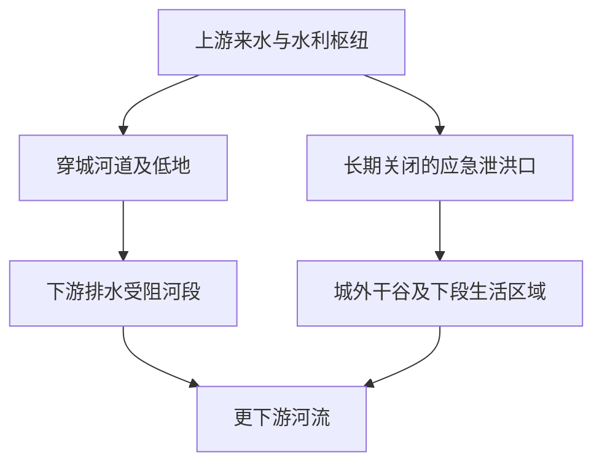

# 城市人物命运游戏策划案 v0.7

- 日期：2026-09-19
- 最近补充：2026-09-20，人口尺度、人物与支持条件优先级，以及 Jev 结构化决策技术候选
- 正式名称：待定
- 项目目录代号：`city-fates`
- 阶段：概念策划与共同讨论；当前深化上游分洪结局、城市与谷地生存关系

本稿整理用户截至本日形成的方向，并补充开发者的判断、结构建议和待决事项。用户授权形成策划案，不等于已经接受其中所有建议。本稿不是完整剧本、功能规格、排期或可行性验收。

**当前设计顺序【用户明确，2026-09-19 更新】**：承接已经形成的玩家能力边界，继续游戏设计，先讨论末日的性质、世界背景与生态机制，再逐步确定地图、人物、交互逻辑、故事与美术。用户明确要求不要急于搭建；本轮授权同步讨论，不启动原型、引擎选型或资产制作。玩法规则仍约束后续设计，未决参数无需先全部定完才能讨论世界。

**本轮进一步澄清【用户明确】**：承接先设计城市面貌与生态自然的工作，用户已主动推进人物分布、后期合作和主线危机，提出观测站补给争论及三种应对方向。当前可以深化这些内容，不恢复到“暂不讨论剧情”的旧阶段限制。生物、环境、城市空间与行为逻辑仍在同一体系中考虑，所需模型与交互由设计逐步产生；不以孤立生物设定或交互关系表填空推进，也不启动实现。

**本版状态约定**：“已认可的背景方向”表示用户同意沿本轮机制与历史框架继续设计；其中未单独确认的物种、设施、功能细节和数字仍标为开发者建议或说明例。认可虚构世界观不等于完成科学验证、玩法验证或制作可行性验证。

**v0.7 本轮承接【用户认可方向并授权同步】**：第一种结局沿“不可逆地启用城外应急泄洪通道，以牺牲谷地既有生活条件换取保住城市的机会”深化。城市包括支撑居民生活的城郊耕地、水源、住所与通路；谷地是相对可靠但容量有限的生活区域和补充粮源。用户认可这组关系，具体地形、水利结构、启用方式、人口与产能仍待设计。本版同步条件与场景关系，不预写必经流程、固定牺牲者或工程操作方案，见第 4.7、4.9.5、6.5、8.6 节。

**2026-09-20 补充【用户认可并授权同步】**：全城幸存者按数百人、最多约一千人的用户倾向考虑；主线以少数具体人物的行动为重心。当前优先落实“熟悉枢纽、能够形成实际方案的人”和“与谷地生活紧密相连的人”，其余接近现场的经验及同行帮助从既有生活中发展。四种支持位置及轻重缓急见第 6.6 节，上游禁区场景方向见第 8.6.8 节；它们不构成固定团队或强制收集顺序。

## 1. 作品定位

### 1.1 核心构想【用户已明确的方向】

在一座持续自行运转的城市或区域中，分布于不同地点的主要人物按照自身需求、经历和行为逻辑生活，周围还有其他居民、组织、帮派与权力关系。有限主要人物不等于城市总共只有几个人。玩家扮演身份尚未确定的高维存在，通过有限而合理的环境交互影响他们，努力让他们活下来，并尽可能走向玩家希望的生活。

玩家没有实体，所见直接是沙盒式 2D／2.5D 大地图，可以查看任何地方正在发生的事情。高维存在的观看形式无需另设高维房间、控制台或接入界面。

【用户当前倾向】玩家的来历与某个结局相连：某个角色因事故或牺牲成为高维存在，或进入高维空间。感觉参照《星际穿越》。具体身份与因果结构尚待讨论。

作品采用多视角、电影式叙事。玩家在首周目先跟随一名 NPC 学习操作，随后逐步认识城市中同时发生的其他经历。上一局错过的人、物品和机会，会成为下一局主动介入的依据。玩家通过跨周目的知识积累与行动调整，争取满足完整／完美结局的条件。

人物行为、环境变化和彼此影响形成大部分具体过程；作者预先设计剧情框架、关键条件、分支及相应演出。

【用户提出的当前主线】下游禁区水文观测站仍有工作人员坚守，以水文情报交换城内居民或组织送来的生活物资。穿城河流与外星生态边界已稳定数年，今年人们争论是否继续冒险送补给。送达可提前得知即将导致城市沦陷的洪水或类似危机；不送也会通过后续生态蔓延认识危机。上游控水、加固安全区和撤离城市构成三种应对方向，各自有不同完成程度与结局。另保留飞船残骸与高维玩家相关的隐藏结局候选，线索须埋入整体叙事，见第 8.4、8.5 节。

【已认可的互动方向】玩家利用场景条件及其引发的因果关系间接引导人物。第一类主动使用对象已有的交互，与角色自动机共用对象规则；第二类促成已有临界条件下的变化。策略深度来自对环境、动物和人物之间联系的理解与利用。助手提出的“短暂施加方向力”核心玩法已被明确否定。

【已接受的表现方向】第一类表现为物件完成正常操作而执行者缺席，第二类表现为时机恰好的自然事件。两类在成立条件和视听表现上保持清楚区分，具体方案见第 5.3.2、5.3.3 节。

【用户新增要求】加入“干涉度”限制，控制玩家持续与现实交互的能力。累积、恢复、反馈及与短时读档的衔接建议见第 5.6 节，具体规则和数值尚未定案。

【用户已确认的方向】短时读档只保留最近数分钟游戏时间的历史，支持局部反复试错；窗口之外的历史不再通过连续回退访问。用户希望保留长期后果，避免依靠无限回退消除全部代价。具体长度及保存规则待定，兼容性评估见第 10.5、12.5 节。

### 1.2 体验重心

- **牵挂具体的人。** 玩家通过持续观察其生活、判断、关系和变化，逐渐有理由关心其命运。
- **积极塑造结果。** 玩家希望人物按照自己的期待生活，并通过真实有效的干预争取这一目标。
- **认识同一段时间的不同侧面。** 新视角与新线索改变玩家对已有遭遇的理解。
- **把认识用于下一次尝试。** 重玩带来新的行动安排、相遇及结局可能。
- **遭遇真实的连锁变化。** 局部干预可以通过环境与人物行为传播，产生难以事先穷尽的后果。

以上是体验目标，尚未通过实际游玩验证。

### 1.3 当前开发者判断【评估】

这个构想最有辨识度的组合，是“有限人物的具体生活＋同步运行的世界＋有限环境干预＋跨周目信息积累”。观看形式、两类互动及其表现方向已经明确，对象权限等仍待细化。当前正在建立世界规则，使后续环境交互、人物生活与危险有共同的因果基础。

主要风险在于：人物行为如何被理解，多人交流怎样可信地承接经历，缺失条件怎样转化为有希望的下一次尝试，以及重复游玩怎样保留新内容和新决策。公开相邻案例能够证明这类机制有先例，尚不能证明本作组合已经好玩或成本可控。

## 2. 决策状态总览

| 内容 | 状态 | 本稿中的含义 |
|---|---|---|
| 有限、具体、能够引发共情的人物 | 用户明确 | 制作重点在个体生活与关系，完成品需要多人 |
| 尽可能拟真 | 用户方向 | 具体保真范围待定，不等于承诺完整现实模拟 |
| 后末日、开放地图、高场景交互性 | 用户方向 | 当前以受生态改造影响的废弃城市及周边为讨论背景；地图边界与规模待定 |
| 《湮灭》《我是传奇》风格参照 | 用户明确并校准 | 美丽、陌生、生命旺盛；冷峻、疏离，自然无情且遵循一致规则 |
| 陌生与熟悉并存、生态共存 | 用户明确 | 地球生命、农场和城市仍在，环境条件与生物关系改变；不预设原生生态全面退出 |
| 丘陵与河流平原交界的中小型城市 | 用户认可的城市方向 | 河流、低地旧城、高处城区及外围农田林地共同构成城市；准确地形、位置与地图尺度待定 |
| 安全区、危险区、禁区 | 用户明确新增 | 未被或轻微改造地区为安全区，安全区与完全共生地区的交界为危险区，工程生物活动频繁的完全共生地区为禁区 |
| 播种系统与生物编程 | 用户明确基础 | 科技造物通过工程生物改造环境，使其适合外星人及其世界的生命；不自动快进演化 |
| 湿润地表、活体基质与水系改造 | 已认可的背景方向 | 保水、物质转移及活动型载体构成统一机制；具体能力、速率和生物形态待细化 |
| 城市水系失控与撤离 | 已认可的历史框架 | 一次汛期使多处失效超过处置能力，城市大规模撤离；具体设施与时间线待设计 |
| 全球文明网络断裂与残存组织 | 已认可的背景方向 | 多地区先后收缩，工业和公共服务网络断裂；保留文明火种，不预设人类灭绝 |
| 随处需要判断的危险及危险生物 | 用户明确 | 危险有现实后果、节律与可察觉征兆；具体生物与危险规则未定 |
| 应对极端危机后继续生活 | 用户明确的结局方向 | 具体危机、持续时间、存活与完整结局条件待设计 |
| 安全区视觉 | 用户明确校准 | 直接以《我是传奇》为视觉参照，城市与地球原有生态深度结合，超出墙缝杂草与普通城市绿化 |
| 主要 NPC 分布与其他人口 | 用户明确 | 主要人物分布于城市不同地点，不全部安排在安全区；还存在居民、组织、帮派及权力结构 |
| 后期合作与人物不可替代性 | 用户明确方向 | 某些行动由特定人物承担，失去其人可能无法完成；人数、职责及替代条件未定 |
| 全城人口尺度 | 用户当前倾向，2026-09-20 | 数百人、最多约一千人；具体人数及谷地统计范围待明确，主要 NPC 数与模拟精度另定 |
| 第一种结局的支持优先级 | 用户认可推进方向 | 熟悉枢纽的人优先影响方案成立；现状知识与同行帮助影响风险；谷地生活联系影响撤离和代价，优先深化前者与谷地关联者 |
| 观测站补给与提前预警 | 用户提出的主线基础 | 下游禁区工作人员以情报交换物资；送与不送均可继续剧情，获知危机的时间与过程不同 |
| 控水、加固、撤离 | 用户提出的三种应对方向 | 各有完成程度及结局；并行方式、互斥关系、工程可行范围待定 |
| 上游分洪的不可逆代价 | 用户明确力度要求，认可当前方向 | 启用应急通道，牺牲谷地生活条件来争取救城；可能付出代价后仍失败，具体结构与窗口未定 |
| 城市与谷地的生存关系 | 用户认可本轮综合方向 | 城市有自身主要粮源、水源及生活基础；谷地较可靠但承载有限，具体面积、产能和人数待定 |
| 条件与场景推动剧情 | 用户反复明确 | 先建立有依据的处境、能力、资源与地点现状；保留人物主动性，不将设定写成强制线性任务链 |
| 飞船残骸与隐藏结局 | 用户提出的候选 | 可联系高维玩家，或进一步终止灾难、收回改造体；均待设计，不自动等于已定真结局 |
| 隐藏线贯穿整体叙事 | 用户明确修正 | 暗示与线索分散埋入全部叙事，不采用观测站特殊记录单独引出隐藏线的方案 |
| 高维存在、有限环境干预 | 用户明确 | 玩家无实体，具体作用方式、强度及限制待定 |
| 来自某个结局中的角色 | 用户当前倾向 | 因事故或牺牲成为高维存在／进入高维空间；具体身份、成因与时间关系未定 |
| 玩家能力约束自组织功能 | 用户明确 | 承接已形成的参与边界；当前已授权继续背景与游戏设计 |
| 利用环境因果间接引导人物 | 用户明确方向 | 玩家改变局部条件，由环境及主体行为传播结果 |
| 玩家与角色自动机共用对象互动规则 | 用户认可方向 | 第一类共用对象状态、交互条件与后果；各自权限待细化 |
| 主动操作与促成临界变化两类互动 | 用户认可方向 | 第一类在对象可正常交互时可用，第二类要求已有临界条件 |
| 两类互动的命运感表现 | 用户接受方向 | 第一类执行者缺席的正常操作，第二类时机恰好的自然事件 |
| 干涉度限制 | 用户明确新增 | 限制持续与现实交互；计费、恢复、反馈及读档规则为待讨论建议 |
| 短暂方向施力作为核心玩法 | 用户已否定 | 不再作为待选的玩法基础 |
| 不直接操控角色行为 | 用户明确 | 人物自行决定及执行行为 |
| 沙盒式 2D／2.5D 大地图、全地图自由观察 | 用户明确 | 可以查看任何地方正在发生的事情；无需实体或高维操作界面，镜头操作细节待定 |
| 同一世界时间、镜头外同步活动 | 用户明确 | 暂停、倍速、场景演出时的时间规则待定 |
| 有限历史窗口的短时读档 | 用户确认方向 | 只保留最近数分钟历史，连续回退不扩展窗口；全世界同步恢复为开发者建议，具体长度、次数与保存方式待定 |
| 随机性与状态机等传统决策 | 技术倾向 | 尚未确认具体架构；大模型不作默认角色决策基础 |
| Jev／System One 结构化决策 | 用户提出适配思路并要求记录；技术候选 | 在人物所知与已有行动范围内辅助语义判断，与程序和自动机组合；尚未选型、接入或验证 |
| 多视角电影式叙事 | 用户明确 | 镜头、表演、字幕、配音及触发规则待定 |
| 自组织过程＋作者剧情框架与分支 | 用户明确 | 具体粒度与衔接方法待设计 |
| 知识积累支撑多周目 | 用户明确 | 角色跨周目记忆、永久成长、能力解锁均未确认 |
| 完整／完美结局 | 用户明确方向 | 名称、条件、价值标准及可达方式待定 |
| 首周目一定无法达成完美结局 | 待决 | 用户提出首周目因未知与未干预而错失条件的体验；是否强制锁死尚未决定 |
| 固定人数、引擎、最低配置 | 待决 | 2D／2.5D 方向已明确，具体表现方案与规格待定 |

## 3. 玩家驱动力与核心循环

### 3.1 从认识人物到改变命运【当前体验设想】

玩家起初面对一个具体的人，跟随他的生活学习干预世界。随着遭遇展开，玩家逐渐形成自己的愿望：希望某人活下来，希望两个人重逢，希望某种关系得以保留，或希望某个人拥有新的生活可能。

这份愿望推动玩家观察更多信息、寻找可作用的环境条件，并承担干预带来的后续变化。

玩家未必能够达成愿望。失败需要留下足以推动继续探索的具体问题，例如“不知道他为什么提前离开”“不知道物品曾被谁带走”“直到后来才知道某人对这次行动的重要性”。

### 3.2 局内循环【开发者建议】

观察人物和局面 → 形成暂时判断 → 选择环境干预或继续观察 → 人物自行行动 → 发现结果与新增信息 → 调整下一步行动。

观察本身需要有内容，包括行为、对话、空间变化和遗留痕迹。干预需要对结果有实际作用。两者之间的等待长度、操作密度和反馈方式尚未设计。

【干涉度的新增设计建议】玩家安排有限的介入，之后可自由观察世界反应、寻找其他机会，并随游戏时间推进恢复介入余量。恢复期间世界继续变化，使等待也有时机成本；具体操作密度需以后验证。

【短时读档方向】玩家可在有限历史窗口内恢复此前局面，带着已有认识调整介入对象、时机或安排，再观察因果如何变化。局部尝试与跨周目的整体安排形成不同时间尺度的学习过程，具体规则见第 10.5 节。

### 3.3 跨周目循环【用户方向的结构化整理】

经历一个不完整结果 → 认识缺失条件及相关人物 → 获得新的时间与因果信息 → 下一周目改变关注点和干预方式 → 看见新的经历与分支 → 逐步接近完整结局。

目前明确的积累是玩家知识。是否提供自动记录、时间线、人物索引、回看、跳过或快速到达功能，均属于待决设计。

### 3.4 开发者关注点【评估】

玩家需要能把“我知道了新事情”转化成“我想试一种新做法”。仅展示另一种坏结局，未必足以支撑重玩。复玩中需要兼顾新发现与重复内容的成本；这是核心设计工作，不应等到完成大量剧情后再处理。

## 4. 世界、风格与空间

### 4.1 风格与叙事立场【用户明确并反复校准】

风格参照《湮灭》与《我是传奇》：美丽、陌生、充满生命，整体冷峻、疏离；人类生活在自己无法控制、此前从未经历过的生态环境中。城市、农场、地球植物与动物仍然可辨认，新增生命和变化的关系带来陌生感。

美丽与生命旺盛是世界自身的状态，不自动意味着安全、食物、奖赏或值得活下去的理由。有些地方危险，有些地方暂时可以生活；外观的美丽不替代对实际条件的判断。

自然过程依自身条件运行。危险来自生物活动、环境条件及人对陌生规律认识有限，不承担教导人类、促进团结或考验意志的目的。“公平”指相同条件遵循一致规则，不保证每个人面对相等风险或得到有利结果。播种系统具有工程目标，这不等于它根据人物善恶、玩家表现或剧情高潮针对人类。

个人抉择、意志、希望与生活属于人物和玩家的经历。玩家关心具体的人，通过观察和有限介入争取结果。整体不预设转向惊悚恐怖片，也不以强行拓宽喜剧、温情等情绪范围作为风格要求；危险生物和真实致命后果仍需存在。

### 4.2 世界根因：播种系统【用户明确基础；具体工程机制为科幻设定】

当前世界观沿“外星飞船坠毁，携带的播种系统进入地球环境并扩散”展开。飞船的任务、来源、坠毁原因和准确年代尚未设计。

播种系统是一种通过生物编程执行环境改造的科技造物，目标是将目标星球的生态、气候等条件逐步改造成适合外星人及其世界动植物生存的环境。当前先具体化地表水分、基质和矿物条件，不据此直接宣告全球气候或大气成分已经完成改造。

统一因果链：**预先设计的生物程序 → 工程生物的生长、活动与代谢 → 环境条件变化 → 原有生态和人类社会响应。**

工程生物的形态可以由已有发育程序形成；地球物种的分布、数量及优势地位可以随环境变化。自然演化、预先设计的发育、生物引入与生态群落变化需要分开叙述。系统不自动将地球动物快速变成全新复杂物种，也不默认能够读取并任意重写所有地球生命。

【开发者的科学边界】生长需要原料和能量，扩散与改造需要时间；载体需要明确的环境适用范围和失效条件。外星生命如何利用地球物质、两套生化体系的兼容范围，仍是需要明确承担并细化的科幻前提。目标条件、代谢途径、规模与速率尚无定量证明，“先进科技”不能替代这些说明。

### 4.3 湿润地表与活体基质【已认可的背景方向；具体性状待细化】

当前采用的改造方向：建立浅层水分充足、覆盖可调节水分与矿物的活体基质的地表，为外星生命提供基础生存条件。外星世界部分生命依赖这种基质，是本轮提出的科幻前提；不扩展为所有地区都必须变成湿地。

工程群落利用光照获取能量，从水体、土壤和可利用的有机物中取得原料。候选功能包括吸收、储存与释放水分，转移或固定特定矿物，按湿度、光照和养分调整活动；条件不足时减慢生长、休眠或死亡。具体物质与阈值待设计。

河流、湿地及浅地下水区域更容易形成密集群落；较干燥、排水良好、缺乏原料或受到维护的区域可以保留原有生活条件。地形、供水、光照及维护造成空间差异。

群落通过生长、截留泥沙及活动型载体搬运材料，逐渐改变局部水流路径。各局部过程叠加，可以使原有排水区域滞水、水流改道，并在新地点创造生长条件。系统不需要具有规划整条河流或指挥所有个体的意识。

【形态说明例，非资产清单】接收光照的薄层、储水组织、输送与支撑纤维、矿化骨架，可在功能确定后推导形态；建筑提供高度、支撑及遮蔽，城市与野外因而可能呈现不同生长形式。薄层颜色、透明度、尺寸及生长速度尚未确定，不直接沿用此前无机制依据的命名物种。

### 4.4 混合生态与危险生物【用户要求；载体方案为当前设计基础】

地球生命与工程生物共同存在。原有植物、作物和动物依据环境适应范围受到不同影响：部分衰退，部分迁移或扩张。共存包含竞争、捕食、侵占和局部共生，不保证生态稳定或对人友善；不预设原有食物网全面退出。

【开发者方案】系统除固定群落之外，携带预先设计的活动型工程载体。其来源是携带的生命材料及已有发育程序，不能因环境改变而凭空出现。当前优先讨论搬运与铺设载体：根据水分和群落信号收集材料，将带有活体组织的团块运到适宜地点。

该类载体的抓握、切割、掘进及防御行为可以伤人；反复通行、搬运和铺设可破坏隔离设施、渠道与道路。感知范围、识别规则、营养与能源来源、发育周期、攻击条件和可避让方式需要具体设计。大型捕食者、主动取食人类及其他生物类型不能由“生态平衡需要”直接推出，仍须逐一建立来源与行为依据。

危险还包括地球动物因食物与栖息地改变进入人类活动区域，以及积水、通路失效和长期浸润造成的设施损坏。每一种危险均应关联具体原因，不能用统一的“外来污染”解释所有后果。

### 4.5 灾难发展与文明网络断裂【已认可的历史框架】

以下为用户认可并要求同步的背景因果框架，具体年份、传播速度、受灾比例与设施规模仍待推演：

1. **扩散与局部应对。** 微小休眠体随水流、泥沙和被运输的材料进入新地点，在条件适宜时建立群落。人类发现异常并采取清除与隔离，一些地方成功，另一些地方留下水下、淤泥或地下湿润空间中的群落。可见范围与已知生活周期不足以代表全部实际分布，不设定所有人都迟迟无视危险。
2. **改造累积。** 群落改变蓄水、排水和材料分布，适宜范围随局部变化扩大。恢复一段渠道可以见效，但上游、旁侧或地下仍有群落时，需要持续维护。
3. **有效但有限的防线。** 人类保护取水口、泵站、堤防、道路与农业区，清除生长物并调整生产。活动型载体使维护作业具有直接风险，也带来反复破坏。火力、机械和隔离可以取得局部效果，系统不具有任意免疫或无限自修复能力。
4. **多地区先后收缩。** 世界范围的关键规模前提是：有效隔离建立前，系统已经在多个彼此分离的重要生产区域扎根。各地失控的时间与原因不同；仍可运行地区最初提供支援，随后因自身维护需求上升而减少外援。
5. **跨地区网络长期断裂。** 食物、能源、原料、设备、运输及公共服务相互依赖，各地转向维持可直接供养自身人口的范围。背景中的文明崩溃指大规模人口损失、众多城市撤离，以及原有工业和公共服务网络的长期断裂。

保留有组织、有技术和生产能力的幸存地区，允许文明火种与以后重新连接的可能性。本地角色很少不等于全球只剩少数人；具体全球人口不为控制本地计算量而强行缩减。

【待深化】多地区扎根的传播路径、重要区域为何无法及时隔离、社会应对如何逐步失去覆盖能力，以及崩溃程度与残存工业能力之间的关系。本轮接受的是历史方向，尚未完成对全球影响尺度的定量论证。

### 4.6 本城历史：水系失控后的撤离【已认可的历史框架；场景细节待设计】

城市曾经缩小生活与生产范围，集中保护核心城区、主要农田和对外交通；外围部分街区先被放弃，城市仍维持运行。人类防护措施曾实际救人并保存设施。

一次降雨充足的汛期，使周围多个群落进入扩张阶段。此前积累的堵塞、滞水和设施损伤在水量上升后共同产生后果，需要同时处理的问题超过处置能力。

【说明性失效链】主要排水通道失效 → 低洼区进水 → 备用道路受淹、维修与运输受阻；农业区失去及时排水而减产；活动型载体随适宜水域进入新街区，增加抢修困难。具体通道、街区、建筑与事件先后尚未绘制或锁定。

外部支援紧张，继续防守需要与其他地区争夺有限资源。管理者最终组织大部分人口撤离，转移人员、设备和储备。城市人口稀少主要可以由撤离解释，不要求所有原居民死亡。大量建筑与物品仍在，部分设施可以继续维护或重新利用。

### 4.7 幸存者、城市与谷地的食物和生活基础【本轮方向获认可；规模待落实】

剧情发生在初期灾难已经过去、幸存者掌握部分地方性知识的阶段。他们可以持续生活，也面对迁移、扩张、天气和旧设施衰退带来的变化。有人留下、有人返回、有人后来到达，是人物经历候选，尚未分配身份。

少数人依托残存设施、有限水源和可生产土地生活，所需维护范围小于原有城市。局部可生存与大规模社会网络断裂可以同时成立，不以特殊免疫解释所有幸存者。

【用户认可的生活方向】保留种植地球作物、积累应对知识、利用部分外来生命的空间。依据本轮共存修正，普通农场或适宜露地种植可以存在，不强制所有人依赖封闭温室。

#### 4.7.1 城市的生产与生活范围

本轮“保住城市”的对象包括城区及支撑其生活的城郊土地。较高处的居住点与周围未被严重改造的耕地相连：城市上缘保留下来的旧农田承担主要口粮生产，台地村落周围的旱地和少量重新开垦的土地补充产出，靠近住所、持续照看的菜地提供蔬菜及部分豆类。准确位置、作物、气候与耕作方式待地图细化。

这些土地由实际居民耕种、储存和维护。家庭、小群体或据点分别经营，并以收成交换劳力、修理或运输，是当前生活组织候选；具体人群及交换关系须从人物经历建立，不凭旧设施名称推导完整农业或物流组织。

主食需要有相应的生产面积、劳动与收获周期。城区野生动物、果树、屋顶种植和遗留食品只能按实际供给作为补充，不能承担全城长期吃饭的解释。具体土地面积、人口、产量、营养、种子和储备尚未核算；认可这一生活结构不等于产能已经成立。

部分居住点可使用与地形相符的坡地泉水、恢复使用的井或小支沟，饮水不全依赖穿城河流。取水、储存和处理能力需要具体落实。修好的屋顶、能够保存粮食的干燥空间、已经搬运和改造的工具，以及住所与耕地之间的通路，共同构成居民难以迅速搬走的生活基础。建筑存在不自动代表适居或有人维护。

#### 4.7.2 谷地的容量与相互依赖

城外应急泄洪通道长期封闭，后接干谷。当前布局方向为上段较窄，下段及谷口保留有限平地、村落和耕地；地形及工程生态差异见第 4.9.5 节。部分从城市低地撤出的人在这里生活，具体迁入经历待设计。适耕土地已被居民使用，山坡能够临时容人不等于能够持续供养新增人口。

谷地农业依当地溪流、小型蓄水设施等条件维持，是相对可靠、能够提供部分余粮的补充来源；不设为城市唯一或绝大部分粮源。城市也有自己的主要生产范围，两边的交换量、丰歉变化与储备仍待核算。谷口重要对外道路是当前场景候选，其地理联系和可替代路线待定。

保留谷地、放弃城市的主要困难，是大量居民失去自己的生产地，带着有限存粮进入容量有限的区域。即使居民愿意接纳，耕地、粮食、种植季节与运输条件仍限制安置。若实际地图和产能允许谷地接纳更多人，应承认这一方案的可行性；提前转移粮食、分批安置或继续外迁均保留为空间，不强制宣告保城唯一正确。

#### 4.7.3 分洪成功后的生存代价

上游分洪方向争取保住城市及周边大部分生产能力，同时失去谷地部分产出，并接纳撤出的人。谷地已有存粮能带出多少、城市耕地能保住多少、人员如何安置，都会影响能否撑到下一次收获。行动成功仍可能需要紧缩口粮或部分居民继续外迁；准备和完成程度更好，才可能保住更多人的生活。

城市的价值来自实际生存条件、已有生活与具体人物的牵挂。两边的利益由人口和生活事实形成，不预先宣布城市建筑比谷地居民重要，也不把谷地人口默认作为必须牺牲的对象。

#### 4.7.4 延续的食物候选与边界

【仍为开发者建议】块茎、豆类、油料与蔬菜的组合；隔离种植槽或温室；残存肥料、储水设施、知识记录、交流与长期维护。来源、面积、产量、营养和维护负担需与实际人数对应，不能用几盆作物解释长期生存。

此前提出外来繁殖体的部分储能组织可以加工成食物，属于待核对的候选，不确立普遍可食性。物种、可利用成分、成熟阶段、处理方法与营养局限需要明确。检测站、操作手册及受训者是知识来源建议，不自动成为正式地点或人物。饮水来源和处理能力需对应具体风险，不用一种方法默认解决全部水质问题。

人、狗与城市外围农场的因果构想保留（见第 5.3.1 节）。农场主人维护熟悉的生产与生活空间；狗与附近猎物需要实际食物和生存条件。进入城市意味着面对掌握较少的环境规律，狗为何继续追逐、未及时折返、主人为何深入寻找仍按当局条件设计。它不是强制播放的固定任务链。

【人数与算力】用户于 2026-09-20 明确倾向全城数百人、最多约一千人；具体人数、谷地是否计入这一范围、主要 NPC 数、动物数和地图规模尚未确定。八人、六至十名主要人物等旧建议不作为定案或性能结论。生活产能需与最终人口对应，角色模拟精度另行评估，不因世界人口数量就假定所有人都运行相同细度的行为系统。

### 4.8 危险节律与终局危机【用户明确目标；具体事件为候选】

危机感通过安全区、危险区与禁区的区别及其空间联系呈现，具体定义见第 4.9.3 节。安全区提供可以生活的环境，交界和工程生物频繁活动的区域承接更明显的危险。农场边缘、通路、建筑与取水地点的风险取决于所在区域与实际条件，不把全部日常空间统一写成高危环境。危险有真实后果，也有依据世界过程形成的节律、征兆和反应机会。地方经验有效但有限，环境变化可能超出人物已知范围。

用户希望结局呈现幸存者应对过一次极端危险的危机后，能够继续生存。危机与既有生态过程相连，人物命运仍由准备、行动、关系和当局后果承接；不自动锁定全员存活、唯一避难地点或特定任务分工。

【用户最新主线方向】文明网络消失后的几年，穿城河流一直稳定，外星生态也没有继续扩大的明显趋势；今年即将出现洪水或类似危机，可能导致城市完全沦陷。观测站情报与城内后续迹象是不同的认知路径，见第 8.4 节。此次危机发生在原有撤离历史之后，不能把历史灾难与本次主线事件合并为同一次。

【本轮采用的深化方向】下游禁区群落通过生长、截留泥沙及搬运堆积改变关键河段，降低排水能力；来水增加时造成壅水及扩张。这承接统一生态机制，并解释下游站的预警价值。确切阻塞位置、形成速度、来水过程和规模待定。稳定期指此前的生活与边界总体稳定，不表示河道内部毫无变化。危险按世界条件推进，不按玩家注意力暂停。

【本轮认可的后果方向】城市沦陷可体现为耕地受淹、水源及储粮点受损、住所与生产地之间的道路中断，退水后部分地区被工程群落占据。仍露出水面的高处建筑不足以保证居民继续生活；具体淹没范围和生态扩张条件须与地形相符。危机后果与第 4.7 节的生活基础对应。

具体警告时间、危机时长、季节周期及游戏时间与实际游玩时间的比例待定。不得沿用已撤回的“六年成熟、三天预警、三十六小时结束”等数值。

### 4.9 城市面貌、生态自然与分区

#### 4.9.1 城市地理与原有面貌【用户认可的方向；具体布局待定】

城市位于丘陵与河流平原交界处，采用中小型城市的背景尺度。用户最新主线明确一条河穿城而过，具体走向尚未选定。低处分布旧街区、仓储和工厂，高处有住宅、学校及公共建筑，外围逐渐过渡到农田、村落与林地。背景中的城市尺度不直接等于最终可见地图的面积或建筑数量。

从远处仍能认出楼房、道路、桥梁和树冠。原生树木、草丛与攀援植物占据无人维护的空间；工程群落沿河岸、沟渠、地下湿润处和建筑阴面形成另一层生长。原有地形、排水与建筑结构继续影响生态分布，保留“陌生但又熟悉”的总体面貌。

#### 4.9.2 不同地段的生态面貌【已认可的整体构想；形态细节为设计说明】

**河流与混合湿地。** 原有河道仍在，部分河岸、旧堤道和低洼地被积水与生长物连在一起。地球湿生植物与工程群落交错；活体基质贴近地表和水面，储水、受光与输送组织形成不同层次。水面、植被、陌生组织与旧桥、建筑共同构成景观。水深、地面承载与生物活动需由实际条件解释。

**低洼城区。** 部分街道长期潮湿，部分雨后积水，少数低处保留浅水。路缘、沟渠、围墙底部和地下入口连接生长区；底层与地下空间受影响较深，上层、楼梯、走廊及平台仍保留可辨认的城市结构。昔日人行空间逐渐成为水、生长物和动物经过的通道，具体通道分布待设计。

**高处城区。** 地面较干，工程群落分布较零散，依附漏水点、背阴庭院和局部湿润设施。原生树木、杂草与攀援植物仍占重要位置，房屋、围墙、花园和路口清晰可辨。这类条件支持保留未被或轻微改造的城市地区。

**外围农田与林地。** 排水较好的土地仍能种植地球作物，近水渠和低地田块受改造较深。有人维护的农场保留渠道、清理边界和使用中的建筑；无人维护的土地依各自条件变化。林地保留原生树种，工程群落进入湿润沟谷、林下积水处及倒木周围。地球动物仍在其中取食、躲藏和繁殖，分布随环境改变。

上述面貌由三部分交织形成：仍可辨认的地球生命、改变局部环境的固定工程群落，以及在适宜地点活动的工程生物。它们的形态、功能与行为需要放在共同环境中设计；尚未确定物种清单、尺寸、密度或完整食物关系。

#### 4.9.3 安全区、危险区与禁区【用户明确新增】

**安全区：未被或轻微被改造的城市地区。** 保留较多原有环境与生活条件，是城市中能够承接日常生活的区域。

【用户视觉校准】直接采用《我是传奇》的视觉参照，呈现城市与地球原有生态结合。原生自然已经明显接管人类空间，不能只表现墙缝杂草、院墙爬藤或普通林坡绿地。安全区的陌生感来自熟悉城市被地球自然重新占用，与工程生态显著介入的危险区、禁区形成区别。

【视觉说明例，未定资产】道路中的连续草地、植被覆盖的废弃车辆、停车场灌丛、院落间连成片的植被，以及动物进入街道和空建筑。建筑与旧设施仍然可辨，人类持续清理、使用的范围只是其中一部分。具体树木尺度、覆盖和损坏程度需对应尚未确定的灾后年数。

【人物分布修正】安全区可有多片，主要人物分布于城市各处，不集中住在同一坡地街区，也不要求全部住在安全区。下游禁区观测站工作人员已进入当前主线；其他居住点的具体分布与生存条件待定。

**危险区：安全区与完全共生地区之间的交界区域。** 作为两类环境相接的过渡地带，具有明确的危险属性；其生态组成、空间宽度及具体威胁随后结合城市整体设计。

**禁区：完全共生的地区，工程生物活动频繁。** 此处沿用用户的“完全共生”表述，指新生态与原有环境充分交织、工程生物活跃的地区；不据此预设所有物种互利或人类也能安全共处。

三类区域是本轮确认的城市空间区别。前轮助手提出“不需要明确安全区边界”的表述由此修正。区域在世界中的具体边缘、形状与连接方式仍待设计，不能直接把高处全部划为安全区、低处全部划为禁区。

【尚未确定的规则】是否及怎样发生分区变化、安全区的具体危险边界、人物进入禁区的条件，以及分区如何在画面中辨认。区名本身不确定永久无伤保护、区域解锁或禁止进入的程序规则。玩家全地图自由观察的已定方向继续保留，禁区也可观察。

#### 4.9.4 表现与范围【待决】

玩家直接观看沙盒式 2D／2.5D 大地图。准确地理位置、河流走向、面积、完整地形、建筑密度及室内范围尚未确定。当前先深化城市与自然生态，具体美术材质、光照、声音、楼层遮挡和镜头操作随后衔接。

天气、昼夜、资源、设施与生物的模拟范围仍需设计。城市内容充分形成后再推导模型、动作、交互与实现需求，不以预设关系表逐格填充内容。宏观聚落经营、岗位分工和人口扩张不由本轮背景自动成为核心玩法。

#### 4.9.5 穿城河流、干谷与应急通道【本轮认可关系；地形为待细化方案】

穿城河流通过常年有水的低平地带，沿岸湿地与工程群落连续分布。群落改变下游关键河段的通水能力，是当前危机深化方向。

应急泄洪口位于上游水利枢纽附近，连接山脊另一侧的干谷，经城外通道向更远、更低的河段排水，绕过致灾低地。入口长期关闭，使谷地没有持续承接主河来水；自身汇水范围有限，较陡岩质河段与排水条件共同限制大片长期滞水。下段和谷口的有限平地承接第 4.7 节居民与耕地。

谷地可有季节性溪流、地球植被和局部外来生命，工程生态影响较轻，仍保留主要泄水能力。干燥与坡降解释相对差异，不赋予永久免疫或绝对畅通。当前阻塞、侵蚀与植被占用应成为实际场景事实，不能让外星生物仅为方便剧情而避开通道。

水路关系示意（不表示已确定的高程、距离或水力效果）：

方案需由地形支持：通道有足够落差与容量，出口绕开致灾河段且不受过高尾水顶托，城区支流与降雨另有出路。将出口画在更下游不自动保证有效。当前没有定量水力模型，也没有确定正常水位、工程容量或启用参数。

### 4.10 修正记录与科学参照

以下旧提案已经撤回或被本轮修正，不作为当前世界规则：

- 仅凭零散供水、农业和设施问题就宣布十八个月内文明彻底毁灭，未说明人类有效应对为何仍不足。
- 将生物圈更替写成原生食物网基本退出、所有人只能依赖封闭设施；当前保留地球与工程生命共存及局部农业。
- 将生态变化写成普通动物迅速演化出全新复杂器官，或不交代来源就添加成熟外来动物群落。
- 无功能依据的“玻璃叶、丝冠、水扇”等命名形态，以及六年后统一繁殖、三十六小时危机等时间设定。
- 把美丽当成人物必须活下去的理由，把危险当成道德考验，或为剧情自动安排普遍安全时段。

本轮核对的科学资料仅支持概念边界：NHGRI 的 [Synthetic Biology](https://www.genome.gov/about-genomics/policy-issues/Synthetic-Biology) 介绍通过工程改造赋予生物特定能力；[工程枯草芽孢杆菌形成活体复合材料研究](https://www.nature.com/articles/s41467-021-27467-2) 展示分泌支架与硅矿化等具体过程。行星播种系统、活动型载体、外星生化兼容性及文明受灾尺度属于本作科幻设计，不能据这些资料声称已经获得验证。

## 5. 玩家身份、能力与时间

### 5.1 玩家来历【用户倾向，具体设定待决】

用户倾向于：在真结局或某个结局中，某个角色因一种事故或牺牲变成高维存在，或者来到高维空间。用户以《星际穿越》中的感觉说明这一方向。

这一倾向为玩家与世界的关系、能力来源及身份揭示提供讨论基础。具体是谁、发生什么、为何能影响所观察的世界，以及该结局与各周目的因果关系，尚未决定。角色是否就是玩家正在观察的某个人，也未正式确认。

【开发者分析】来历与能力应共同解释“能施加什么作用、为什么作用有限”。当前可以讨论这一解释需要满足的条件，具体事故与牺牲情节留待边界明确后设计。该参照不自动确定自由访问过去未来、时间闭环或某种物理作用机制。

### 5.2 观看形式【用户明确】

- 玩家没有实体，直接观看沙盒式 2D／2.5D 大地图。
- 玩家可以查看任何地方正在发生的任何事情，观察无需绑定某个角色或等待区域解锁。
- 高维空间是存在方式与来历的解释，无需额外呈现高维房间、控制台、接触窗口或接入装置。
- 用户明确提出没有实体或“操作界面”；本稿据上下文记录为直接观看与作用于地图的方向，具体输入和操作反馈如何呈现尚待设计，不预设按钮面板或完全无提示的方案。

【开发者分析】全地图可观察使玩家可以取得分散在不同地点的信息；玩家实际注意到、记住和理解多少仍随游玩过程形成。人物的内心、记忆，以及过去未来的信息是否直接可读，不由空间上的观察自由自动确定。

### 5.3 干预边界【已形成方向及待细化权限】

已明确：玩家能够有限、合理地影响环境；人物自行作决定，玩家不能接管身体或直接指定人物行为。玩法利用环境中的因果联系引导人物。两类互动方向及其表现已经认可，具体对象清单、输入方式和干涉度参数仍待细化。

**已否定的方案**：将“对场景物体施加短暂、有方向的力”作为基本玩法。后续从可介入的环境关系与共同互动机制讨论权限，不以该方案继续推导玩法。

【用户认可的方向】第一类行动逻辑可以由角色自动机使用，玩家与角色共用对象状态、交互成立条件和后果；玩家采用符合高维来历的表现方式。

【开发者分析】玩家依据全地图观察与已有知识选择介入，人物依据自身感知、需求和判断选择行动。共用规则仍允许不同的操作权限、发起条件与代价。具体实现及节省成本的程度尚未验证。

| 层次 | 玩家承担的选择 | 自动机及程序承担的过程 |
|---|---|---|
| 场景交互 | 选择符合权限和条件的对象、交互与时机 | 检查前置条件，执行共同规则，更新对象及关系状态 |
| 环境传播 | 观察影响，决定是否继续介入 | 处理危险、通行、物品、线索等变化及其相互影响 |
| 主体行为 | 利用已认识的动机与处境争取结果 | 动物和人物感知、理解、权衡、交流、行动及重新判断 |
| 剧情呈现 | 选择关注与介入的位置 | 依据当局事实承接作者框架、分支与演出 |

以下仍需细化：两类互动各自允许操作的对象及条件；哪些完整任务由人物承担；干涉度怎样限制组合和同时介入；是否能通过场景传递明确意思，以及人物如何逐步认识异常。脱困与阻挡、危险触发、物品取得与失去、线索显露仍是讨论类型，不是完整能力清单。

### 5.3.1 因果引导的说明例【用户提出，非正式剧情】

- 帮助被某角色的狗咬中的猎物脱困，猎物逃离引起狗继续追逐并进入城市，促使原本不愿前往废弃城市的主人寻找爱犬。
- 在某角色必经之路上弄落马蜂窝，使其被蜇伤，因而避开原本必死的任务。

两例说明玩家希望利用的策略关系，不确定人物、地点、动物、任务或具体操作。第一个例子连接猎物处境、狗的追逐与主人的牵挂；第二个例子通过眼前伤害改变任务执行条件。

【开发者分析】因果各环节需要读取实际状态：猎物如何脱困、狗为何继续追逐、主人如何发现失踪并权衡风险；伤势怎样改变人物能力或计划。程序根据这些条件产生后续，具体玩家动作怎样使最初条件改变，仍是当前待设计的问题。共享这些关系有望支持多种策略，成立范围需要后续验证。

### 5.3.2 两类互动的具体分界【用户认可方向；对象示例待细化】

| 项目 | 第一类：主动使用对象交互 | 第二类：促成已有临界变化 |
|---|---|---|
| 成立条件 | 对象具有正常可用的操作，且玩家有相应权限 | 对象或环境已经形成相应机会与临界条件 |
| 玩家发起的事情 | 一次开启、关闭、启动、解除或显露等交互 | 使正在酝酿的变化在当前时刻发生 |
| 说明例 | 无风时打开完好且未上锁的门；拨动可操作旋钮 | 已开裂的承托枝条折断，使蜂窝脱落 |
| 世界后果 | 按对象共同规则改变通行、装置状态或信息可见性 | 原有原因继续传播，环境和主体自主应对 |
| 表现重心 | 正常操作的执行者缺席 | 有迹可循、时机微妙的自然事件 |

第一类具有主动性，普通交互不再额外附加“先刮风、先松动”等第二类机会条件。第二类的临界状态应有依据并可观察，其可用性随世界变化出现或消失。同一对象可包含不同种类的操作，但每项操作的条件和直接结果需要明确。

【开发者的权限草案】第一类优先覆盖对象已有的简单操作部件；开闭、释放、启动和显露是候选操作族。长距离搬运、制作、维修、治疗及战斗等完整任务交由人物承担。锁具、工具、电源、燃料、阻挡及其他成立条件由共同规则校验；具体哪些部件允许玩家直接使用，需要逐项细化。

一扇门的把手转动与门扇打开可以具有不同条件。若把手能动而门锁未解，世界可以实际发生一次把手动作，门保持关闭；若装置无电，开关动作仍可能发生，装置保持停机。这些部分结果需要与干涉度的计费和反馈一致，避免把“未达到玩家期望”误记为“从未发生操作”。

### 5.3.3 命运感与人物感知【用户接受表现方向；细节为开发者建议】

第一类使用真实的物件动作、材质声音和可持续的结果，表现一次执行者缺席的普通操作。门把手压下、旋钮转动、插销退出、抽屉沿滑轨打开，是表现示例；具体资产和动作尚未制作。角色交互中的物件部分可以复用，玩家交互省去人物走近、伸手等身体表现。

这一方向允许现实中出现微小而可察觉的异常。高维存在可以跨过身体及空间位置接触有限交互，具体成因留待来历深化。表现保持克制，采用物件自身动作，不预设发光手、能量射线或实体化的控制装置；短暂的主观反馈与世界中真实可听见、看见的事件应分别处理。

第二类完整呈现已有原因：枝条裂损、承托失效、蜂窝下落等自然过程。玩家介入体现于发生时机，环境动势承接后果；它与第一类主动使用完好对象的表现保持区别。

【开发者建议】人物依据距离、视线、注意力及实际经历察觉异常。可以从未注意、发现单次异常、尝试日常解释，到反复经历后寻找规律；具体反应取决于人物和处境，不统一套用固定阶段。人物警觉由可感知事件产生，不能直接读取玩家的干涉度。是否最终识别玩家或建立沟通仍待决定。

命运感来自操作时机、人物的在意与后续意义。大部分交互保持简短，仅在相关人物注意到或对象具有个人意义时承接更具体的反应。频繁夸张的异常可能将气质推向闹鬼，后续视听设计需兼顾日常质感和高维来历。

### 5.4 视角和同步时间

玩家与人物共享世界时间。跟随一名人物期间，其他人物同步活动；离开镜头不会自动停止其生活。全地图自由观察已经确认，镜头平移、缩放和定位的操作细节仍待设计。

用户已确认短时读档采用有限历史窗口，连续回退不扩展可访问的历史范围。开发者建议回退时全世界恢复到同一历史时刻，随后同步向前推进；这一恢复范围尚待确认，详见第 10.5 节。暂停、倍速及演出时间规则仍待讨论。

读档功能是否属于世界观中的高维能力，以及更广泛的跨时间访问权限，尚未确定。结局中的来历与局内时间操作分别讨论；多周目已确定积累玩家知识，其世界观解释尚未定案。

【开发者建议】后续时间规则需说明整个世界如何一致推进，尤其是暂停期间是否允许干预、重复内容如何快速承接，以及演出怎样承接镜头外事件。

### 5.5 对后续自组织设计的约束【开发者分析】

能力边界确定后，再划定玩家直接造成的变化，以及环境传播、人物感知、理解、交流和行动分别承担的过程。人物如何响应，将依据最终选定的能力设计。

当前可以明确的依赖关系是：可介入的环境关系决定世界需要承接哪些变化；信息传递程度决定人物需要自行发现与解释的内容；组合和同时交互的范围决定玩家能安排多少条件；时间权限及回退规则决定玩家怎样尝试和修正。这些关系用于安排设计顺序，尚不构成行为系统规格。

### 5.6 干涉度【用户明确新增；以下具体规则为开发者建议】

**已确认目的**：控制玩家不能一直与现实交互，使其选择介入时机和对象，保留世界及人物自主运行的空间。用户尚未指定数值形式、消耗、恢复或惩罚规则。

**建议基础形式**：使用全地图共用的干涉度，表示近期介入现实所积累的负担。每次有效干涉增加负担，随游戏时间推进逐渐消退；超过可承受范围的操作暂时无法发起，玩家仍可自由观察。切换地点、人物和两类互动不重置或另开额度。

| 项目 | 当前建议 |
|---|---|
| 影响哪些行为 | 两类主动干涉共同计入；观察、镜头移动、查看已经发现的信息不增加负担 |
| 计费依据 | 根据直接交互的规模、复杂程度及持续要求设定，并在执行前给予可理解的反馈 |
| 两类相对代价 | 第一类主动完成操作，第二类借用已有变化；可考虑后者在相近直接效果下代价较低，具体比较与数值待定 |
| 连锁后果 | 一次干涉产生的自然传播及人物后续行动不逐环节追加费用；不按未来剧情重要性或结局好坏计费 |
| 达到限度 | 在发起前检查余量，无法承担的交互暂不可用；不以随机失灵或额外灾难作为默认反馈 |
| 恢复 | 依据当前世界实际向前推进的游戏时间消退；若支持暂停，暂停中不恢复；倍速跟随世界时间 |
| 等待的代价 | 恢复期间人物和事件继续活动，机会可能变化；保留观察和寻找替代安排的内容 |
| 持续与同时操作 | 若后续开放，应事先预留相应余量或持续计费；避免通过并发绕过全局限制，具体方式待定 |
| 人物与世界观 | 可暂以高维接触的承载限度解释，具体成因未定；人物的异常认知仍依实际感知形成 |

**何时算一次干涉**：只观察、检查条件或被系统在动作发生前拒绝，不增加负担。物件实际发生动作或世界条件开始改变时计费，即使人物未察觉、拒绝配合或后续不合玩家预期，这次介入仍已发生。把手转动但门未打开也属于实际动作；可支持的中断交互需明确已经发生的部分。共同状态变化与干涉度记录应保持一致。

**与短时读档的建议衔接**：干涉度、恢复进度及尚未完成的占用随历史世界状态一起恢复。撤销的动作和相应负担一起撤销；恢复点之前已经发生的干涉仍保留当时负担。读档不另行回满，也不默认累积跨尝试的额外惩罚；等待获得的恢复量也随读档返回历史值，避免保留恢复量却撤销世界时间的推进。有限历史窗口的边界独立遵守既有规则。

**反馈建议**：在选择或尝试交互时，清楚表达是否能执行、代价的大致等级和何时恢复到可用范围。具体采用物件响应、克制的声音或其他反馈尚待设计，不预设常驻能量条、数字面板或高维控制台。反馈应可辨认，不能为了神秘感掩盖限制。

**待验证的取舍**：恢复太快会使玩家能够持续操纵，太慢会使观察退化为单纯等候。初步目标是允许少量相互配合的操作，随后留出世界回应的时间；全局限制也会使不同地点的机会相互竞争。具体上限、消退速度、动作代价与连续操作规则需结合交互密度确定，本版不填入未经验证的数值。

## 6. 人物生活与自主行为

### 6.1 人物规模与细致程度

完成品需要多角色，主要人数未定；全城幸存者当前按用户倾向考虑数百人、最多约一千人，准确人数及谷地统计范围待明确。用户明确区分主要人物与其他 NPC：城市应存在其他居民、组织、帮派及权力结构。主要人物分布于不同地方，具有不同经历和信息来源，支持多周目认识同期事件；不集中在同一生活街区，也不全住安全区。第一种结局以少数具体人物的行动为重心，不由人口规模转向宏观群体动员。

助手此前提出的八名主要人物、六处居住点和按职业分配职责的方案，用户表示大部分不能用，因此不作为当前人物名单或地图依据。农场与狗保留原有构想，下游禁区观测站及坚守工作人员由用户明确纳入主线；其余人物从具体生活、组织和剧情关系中设计。

【用户明确】后期希望形成多人各司其职、合作应对危机的结果；某些事情由特定人物承担，失去他／她就可能做不到。个体的生活、关系与意愿仍需成立，不把此要求扩展为玩家经营岗位或直接分配角色任务。

【开发者建议，未确认细则】不可替代性可以来自专业知识、现场经验、控制的资源、群体信任或尚未传播的信息。知识传授、记录与交接是否能保存部分能力，需要逐个方案决定；不能默认所有人都可替代，也不把每个人的死亡统一设为全局失败。

【社会结构候选】居民群体、分散家庭、掌握交通或物资的组织、往来人员可以共同存在。权力需对应实际控制能力、依赖与信任，不默认所有组织都敌对。群体名称、地点、人口、资源及成员关系尚未确认。总人口与生存条件一起设计；模拟细致程度另作技术评估，不能用少数主要角色倒推全城人口。

“拟真”当前优先理解为行为与处境有连续、可感知的联系。这种联系需要涵盖哪些生活细节，仍待具体人物和玩法共同决定。

### 6.2 候选建模内容【开发者建议】

| 内容 | 可能需要承接的事情 |
|---|---|
| 身体与当下需求 | 饥饿、疲劳、伤病等怎样影响活动能力与安排 |
| 所知与判断 | 亲眼见过、听别人说过、仍不确定或尚未发现的事情 |
| 日常与当前打算 | 熟悉的生活方式、正在完成的工作、打算去的地方 |
| 重要经历 | 已发生的损失、帮助、约定及其后续影响 |
| 人际关系 | 对具体人的认识、愿意共同做什么、哪些事情尚未解决 |
| 行动与交流 | 怎样取得信息、表达意愿、执行计划及应对变化 |

这不是要求先建立完整人格模拟器，也不是已确定的一套属性表。数值、标签、事实记录及行为规则怎样配合，尚待选择。

### 6.3 压力与行为变化【用户明确方向】

环境压力应当足以促使人物改变原有行为模式。原本能持续的生活，可能因为危险逼近、资源变化或他人行动而变得难以维持。人物如何察觉、理解并应对这些变化，构成玩家干预的重要空间。

用户给出的农场例子说明这一关系：一名维持种菜、砍柴、睡觉日常的人，遇到逼近的危险，需要改变生活方式才能获得生机。人、狗、外围农场构想在本轮背景中保留，具体人物与路线未定；当前危险需从第 4 节生态机制推导，早期丧尸说明例不作为本作世界设定。

压力的后果可以改变人物行为，但生态本身没有促成人物成长或考验其价值的目的。人物按所知条件生活，玩家通过更广的观察与有限干预帮助改变条件。

### 6.4 随机性【技术倾向，细节待决】

倾向使用随机性与状态机等传统方法。具体采用分层状态、效用权衡、行为树、计划系统或组合方式，需要依据所需行为确定。

【2026-09-20 技术候选补充】用户提出 TypeSafe AI 的 Jev 思路适合本作，并要求记录讨论。当前考虑由结构化决策模型辅助人物对处境、关系和经历作判断，由程序维护世界事实、持续意图和执行过程，见第 12.6 节。此前传统系统倾向不排除这一组合，具体方案尚未选定。

【开发者建议】随机变化应当受到人物处境和行动条件影响。关键风险是同样的有效准备被无迹可察的随机结果反复推翻，使玩家难以从重玩中积累经验。是否固定种子、限制关键决策的随机性或保留相同初始条件，均待讨论。

【短时回退的新增建议】同一存档恢复时连同随机过程恢复，帮助玩家比较操作变化的影响。只保存开局种子不足以代表历史时刻的随机进度；完整重现还依赖其他世界状态和处理顺序。局内读档与跨周目随机规则分别决定。

### 6.5 人物、支持条件与冒险来源【用户反复澄清】

用户提出通过寻找能够提供关键支持的 NPC 形成冒险内容，随后指出不必预设核心团队。具体人物先从某种应对需要的支持、现实生活与关系中形成，不再给职业岗位附加任意性格就视为完整人物。此前被否定的成套人物名单均不作为依据。

人物可以自主提出方案、找人、求援、拒绝或坚持行动。一个熟悉设施的人能够同时承担查看、判断和修理；资料、人手与物资影响把握及结果，不需要全部齐备才允许尝试。少数人的行动可以违背其他居民意愿，城市共识不作强制前置条件。

【用户方法示例，非定案任务】某人当过修理工，掌握技术却没有工具，记得以前养护场存放过所需设备。旧地点如今是否仍有设备、危险如何、能否取得，需要具体设计；人物的记忆只说明过去，不自动赋予对现状的完整知识。技能、持有物、旧记忆和现状之间的缺口，可以自然产生寻找、相遇、冒险和替代方案。

养护场、货运市场等旧地点可以存在，但旧用途不直接推出原班工人、持续维护、齐全库存或完整物流组织。人物的灾后生存方式、物资留存或搬迁、组织实际控制的东西，须有相应经历和环境依据。助手应提出这些问题的具体候选答案，而非把设定任务交回用户。

当前交付以人物处境、地点现状、能力、所知与所求构成的条件为主，保留电影和小说所需的具体性与冒险潜力；不预写必经的出发、失败、返回求援等线性链条，也不为每个支持缺项配置独立人物或强制任务。

### 6.6 第一种结局需要的人与支持优先级【用户认可，2026-09-20】

本轮恢复推进此前未完成的人物和支持条件设计。“重启条件考虑”指这项设定工作，不能继续只展开设施怎样重新运行。以下按支持对结果的作用区分轻重缓急，不是人物收集顺序；多项能力可以属于同一人，不预设固定核心团队、四名固定角色或最终名单。

#### 6.6.1 熟悉枢纽、能形成实际做法的人：首先影响路线能否成立

优先设计一名曾参与这处枢纽运行或检修、接触过应急设施的人。他知道设施原本能做什么，能够辨认留下的设备，并结合现状提出做法；可以同时承担查看、判断和主要操作，不再拆分为资料、勘探和方案专家。观测站异常信息或其他实际迹象可以促使他重新判断旧运行方式。

当前最需要建立的是他的生活与参与意愿：住在哪里、靠什么生活、知道多少危机、为何愿意或不愿意冒险。职业经历提供能力依据，不自动决定当前职业或行动动机。

在有限人口和剩余时间内，他可以确实缺乏及时可用的替代者；失去他，可能使本轮路线无法完成。不可替代性来自具体知识、经历及信息是否已传播，不以职业标签设锁。具体经历、现有工具、知识记录和替代可能仍待人物设计。

#### 6.6.2 熟悉上游现状的人：主要影响时间、携带能力与风险

需要补足旧设施知识与当前环境之间的差距。相关人物因自己的生活反复经过附近，知道道路哪里塌了、旧山路还能到哪里、工程生物在何处活动；未必进入过机房，也不拥有全部信息。使用绕开危险区的山路是经历候选，须与住所、往来对象及生活需要共同建立。

没有这项帮助，熟悉设施的人仍可以尝试进入，但可能走错路、带不进设备或在作业前受伤。这是重要支持，通常不作为必须找到某人的硬性前提；相关知识也可以由其他角色的经历承担。

#### 6.6.3 愿意同行、分担现场工作的人：改善行动余地

搬运、协助操作、照顾伤者与接应需要有人承担；这些能力未必稀有，不各自创造一名精英角色。一两名同行者是当前规模示例，人数仍由实际工作决定，不设成最低队伍人数。

重点在于谁愿意投入自己的时间和生命。信任、城内牵挂或个人选择等可以成为动机，但须从人物处境形成。人数较少允许先行、勉强尝试或采用不同办法；可靠帮助增加携带量和处理意外的余地。可以由已有角色承担或与其他支持重合，不必须新增角色。

#### 6.6.4 与谷地生活相连的人：决定代价怎样落到具体人身上

此人通过日常往来知道分散住户的位置、谁仍在田里、谁无法自行离开、粮食存放在哪里。他不必是领袖，也不代表全谷地。具体生活和往来关系待设计。

上游行动不以他的同意为前置条件；缺少这些联系，即使发出警告，也可能未能及时到达需要知道的人。他影响谷地人口和生活物资的保存，以及后续人物之间的关系，不能简化为群体支持度。他可以反对分洪，同时帮助认识的人撤离。

#### 6.6.5 物资与条件的轻重缓急

- **决定方案形成的支持**：能提出实际做法的知识与经验，优先落实到熟悉枢纽的人。
- **可能直接决定能否完成的支持**：由实际故障和作业确定的关键工具或附件。先明确具体用途，再追查谁知道、谁持有、在哪里；不预填稀有道具或采购清单。
- **显著影响时间与风险的支持**：现状知识、接近现场的办法和同行协助。允许不足、替代或从不同人物处获得。
- **决定代价与结局质量的支持**：谷地生活联系、运输和粮食转移。与上游行动并行，不要求先完成全体撤离或取得全城同意才允许行动。

当前优先落实两个具体人物：熟悉枢纽的人，以及与谷地生活紧密相连的人。前者使方案有机会出现，后者使代价落实到真实生活；接近上游的经验和同行协助随后从城市其他人物中寻找归属。两人可以理解彼此甚至合作，仍对时机、准备和损失有不同判断；不预定二人必然对立或必须同场争论。姓名、性格、经历和关系仍待深化。

## 7. 多人交流：核心未决问题

### 7.1 交流目标

人物需要能够针对当局实际经历交换信息、提出请求、回应他人并影响后续行为。玩家还需要从交流中认识这些人，而不仅仅取得任务信息。

交流的频率、长度、自然度、闲聊比例、配音与字幕形式，以及角色需要谈论多细的历史内容，尚未确定。

### 7.2 需要共同解决的三个层次【开发者分析】

1. **交流动机与内容。** 此人为什么在此时对这个人开口，想表达或取得什么。
2. **互动过程与结果。** 对方听到了什么，是否相信、追问、拒绝、接受、沉默或中断，后续行动如何承接。
3. **语言与表演。** 台词、动作、停顿和节奏如何表现人物差异及当前关系。

只在行动状态后附加台词，难以覆盖这些需求。对话可能改变所知信息、约定和计划，因此需要与生活模拟相连。

### 7.3 路线候选【尚未选定】

| 路线 | 可能收益 | 主要成本与风险 |
|---|---|---|
| 人工对白与条件组合 | 措辞、人物风格和事实容易审阅 | 复杂经历组合需要大量覆盖；泛用对白可能掩盖真实原因 |
| 交流行为规则＋人工短段落 | 复用请求、问答、提议、异议等互动结构 | 仍需处理指代、承接、重复、话题与中断；不保证自然 |
| 行为与非语言表演承担部分交流 | 关系可以进入共同活动、等待和回避 | 动画与表现同样有成本；不能代替全部语言需求 |
| 模型辅助表达 | 可能提高具体情境的表达覆盖 | 延迟、成本、人物风格、凭空承诺及后续无法承接等问题 |

模型辅助表达不等于模型接管全部行为，也不等于问题已经解决。制作期 AI 辅助和运行时模型是不同选择。当前不启动训练、不沿用原项目的聊天模型或数据。

【Jev 候选的分工】第 12.6 节讨论的 Jev 可作为交流中的判断辅助候选，例如选择追问、回应或拒绝等已有行动。它不直接生成对白；语言、表演及交流对双方认识的更新仍需独立设计。其候选地位不表示多人自然交流问题已解决。

## 8. 自组织过程与作者剧情框架

### 8.1 共同结构【用户已明确方向】

| 层次 | 作者准备的内容 | 当局运行决定的内容 |
|---|---|---|
| 世界与人物 | 世界规则、初始处境、行为逻辑与人物基础 | 活动、资源变化、发现、相遇及后续作用 |
| 叙事框架 | 关键事件族、条件、时间关系、分支与结局要求 | 哪些条件成立、何时成立、涉及哪些实际状态 |
| 场景与演出 | 对应情境的对白、表演、镜头及表现方法 | 此次应呈现的版本、参与者、对象与前后衔接 |

角色与环境形成具体经历，作者使其中的重要变化具有可呈现的叙事结构。触发式场景可以承接模拟结果，也可以引入框架内的外部事件；两者在设计中应标明。

【用户后续澄清】先丰富开篇与结局之间的主线条件和内容，再补支线；主要规定大致走向与可能结局，按实际效果补充部分完整演出，其余由自主行为和环境作用承接。观测站补给争论定位为篇幅较短的首个正式事件，不能反复扩写它来代替中段内容。支持人物的冒险关系见第 6.5 节。

【设计依赖】具体哪些过程由人物及环境自主完成，依据第 5 节的能力边界与第 4 节的世界规则共同展开。当前已进入背景与游戏设计讨论，仍未启动实现。

### 8.2 剧情触发【开发者建议】

一个重要节点需要明确：

- 世界中的什么条件使它成立，时间窗口是否有限。
- 谁参与、谁知情、涉及哪些仍然存在的物品或地点。
- 它会产生什么实际变化，是否还能撤回或补救。
- 玩家正在观察与未观察时怎样发生，之后如何取得相关信息。
- 不同状态对应哪些内容，以及未满足条件时怎样继续。

这些要素用于确保当局连续性，不要求每个生活动作都成为剧情节点。

### 8.3 分支与长因果

用户希望通过复杂系统形成深层连锁，避免仅用人为串接的固定因果链假装开放。人物、物品、信息和环境需要通过共同规则真实地相互影响。

【开发者建议】分支条件尽量读取当局已经发生的事情。诸如“缺少某物就无法进行后续行动”，需要有具体用途；“某人缺席导致方案改变”，需要能从其处境、关系或能力上理解。

蝴蝶效应与深层因果是设计方向，不能直接当作策略深度的证明。玩家可以无法追溯全部细节，但需要能够逐渐学会一些有效的干预关系。

### 8.4 观测站、危机认识与三种应对【用户提出的主线；机制细节待深化】

#### 8.4.1 长期关系与开端

下游禁区的一座水文观测站仍有工作人员坚守。城内人们或某组织定期向他提供食物等生活物资，以交换水文情报。承担补给的具体组织、运送者、运输方式和通信条件尚未确定，工作人员姓名与经历也未定。

文明网络消失后的几年，穿城河流一直稳定，外星生态没有明显继续扩大的趋势。今年人们正在争论，是否值得再次冒险进入禁区，为工作人员送去生活物资。长期稳定与送达风险构成争论的现实背景，不把其中一方预设为愚蠢、邪恶或理所当然正确。

【用户明确的篇幅定位】这是玩家经历的首个正式事件，篇幅不长。后续主线需要丰富的中段人物、场景及行动条件，不能继续围绕补给争论占据主要设计篇幅。

【开发者建议】可以将本次争论对应一个重要补给窗口；实际补给频率需符合食物、储存与其他生活条件，不由“今年是否送”推导全年只送一次。支持继续维持、主张停止投入、希望接人返回等立场均为待设计候选。

#### 8.4.2 送与不送都继续剧情

**送达物资**：提前获得即将爆发洪水或类似危机的情报，能够更早开始理解与应对。

**没有送达**：城市居民后来也会注意到生态不断蔓延的迹象，经历恐慌并最终得出危机将至的相同结论。主线仍然继续，不因未完成补给而关闭全部后续内容。

【开发者建议】两条认知路径可以在获知时间、记录完整程度、信任和准备余量上产生差异；迟送、折返或接人也可形成中间情况，尚未定为正式分支。工作人员自身的去留与生死须另有实际条件，不预设一次不送就立即死亡。

【既有玩法约束】玩家全地图自由观察，包括禁区与观测站。玩家看到或推知的事情，与城内人物收到、理解和相信的消息是不同状态。补给分支不能通过强制遮挡观测站来实现信息差，也不意味着玩家可直接把结论写入 NPC 的认识。通信与情报传递方式须有世界内依据，不能临时为送货任务安排通信失效。

#### 8.4.3 本次危机与水文候选

【用户方向】洪水或类似事件造成城市完全沦陷的威胁；通过不同应对及完成程度形成不同结果。确切事件类型、形成机制、覆盖范围、时间尺度，以及“完全沦陷”的具体后果均需设计。

【本轮认可的深化方向】下游工程群落降低排水能力，较大来水使上游壅水并增加城市生态扩张风险。工作人员比较水位、退水和流速记录，提前识别异常；“相近来水下水位更高、涨水后退得更慢”是线索候选，不单凭一次记录确定成因。其他人物也可以观察到局部变化，观测站仍有提前预警价值，确切征兆和来源待设计。

【本轮认可的后果方向】完全沦陷体现为居住地、生产地、水源和通路的生活联系破坏，高处建筑仍可能露出水面。保城需要保住足够的生产和生活条件，不能只保住空房屋。具体范围承接第 4.7、4.8 节。

#### 8.4.4 三种应对与不同完成程度

**方向一：上游控水。** 用户提出去上游重启大坝或疏通运河，可能大幅削减乃至断绝穿城河流来水，进一步争取恢复沦陷区。这是路线目标候选，尚非已经成立的水利工程方案。

【本轮深化】沿不可逆启用城外应急泄洪通道推进，以谷地既有生活条件的损失换取救城机会，见第 8.6 节。利用已有工程和地形，来水仍须有实际去处；库容、通道能力、现状与人的行动范围共同约束效果。控水后的群落衰退和地区恢复仍需生态规则支持，不默认禁区随启用立即消失。

**方向二：加固城市现有安全区。** 用户提出防止入侵，保住居民仍可生活的地方。具体保护对象、入侵途径、工程生物威胁、排水与维护条件待设计。保住哪些区域、范围和后续生活能力，可以对应不同完成程度。

**方向三：撤离城市。** 用户提出离开将要沦陷的城市。哪些人能够离开、携带哪些维持生活的资源、到达何处，以及是否具备接纳或安置条件，仍需设计。

【用户明确】各条路线有自己的完成进展与不同结局。

【开发者建议，未定互斥规则】允许路线相互影响或组合：部分控水可以为防守或撤离争取时间，部分居民撤离、其他居民留下也可成立。结果优先承接实际完成的事情，而不预设统一百分比条、三选一按钮或唯一最佳排序。是否可以充分完成多条路线、如何形成完整结局，仍待确认。

人物按自己的信息、意愿、资源与关系推动这些方向；玩家继续通过环境因果有限介入。三种应对不是直接赋予玩家的宏观指挥权限。

#### 8.4.5 科学核对的适用范围

此前讨论核对的 [NWS 洪水危险说明](https://www.weather.gov/safety/flood-hazards) 支持阻塞可导致上游洪水这一原理；[USACE 水库调度说明](https://reservoircontrol.usace.army.mil/nae_ords/cwmsweb/other_html.protection_level) 涉及库容、河道能力和操作条件；[USACE 分洪原理](https://www.hec.usace.army.mil/confluence/hmsdocs/hmstrm/diversion-modeling) 说明将部分来水导向其他通道或蓄水区域。这些资料支持一般约束，本作地形、工程生物、水利设施和可实施规模仍是待设计内容。

### 8.5 飞船残骸与分布于整体叙事的隐藏线

【用户提出的候选】发现外星人坠毁飞船的残骸，回应成为高维存在的玩家；也可以进一步考虑彻底结束灾难、收回改造体。飞船如何回应、是否解释玩家来历、能否终止系统以及影响范围均未定，隐藏结局与真结局／完美结局之间的关系也未锁定。

**线索原则【用户明确修正】**：如果存在隐藏线，其暗示与线索指向应埋入全部叙事之中。撤回助手提出的“观测站工作人员发现某方向工程群落的特殊规律，再由其记录单独引向飞船”的方案。观测站承担主线水文与补给关系，不作为隐藏线唯一入口、解释中心或必经触发点。

【开发者整理】隐藏线应与不同人物经历、环境现象、历史痕迹和主要应对过程一同设计，线索在各自情境中先有实际意义，更多认识再改变其解释。具体线索尚未创作；这项原则不等于每个场景强塞线索、每个人都知道飞船、必须依次通完三条路线或收集固定数量碎片。

【开发者建议】“装置响应高维干涉”和“工程生物接收停止／休眠／回收指令”分别建立机制，避免单一万能开关。回收能力如果采用，需说明信号范围、仍受控的载体及执行过程；已发生的洪水、设施损伤和人员处境如何承接，也需解释。以上仅为深化要求，未提前否定用户提出的彻底结束灾难候选。

### 8.6 第一种结局：以谷地代价争取上游分洪救城【用户认可方向；实施条件待细化】

#### 8.6.1 反差来自原有保护的价值

用户要求当前运行方式在过去确实提供便利，其改变会首先损害人们的生活；多数人物维护旧方式应有常识依据，少数人察觉环境已变并尝试新的应对。当前把这一关系落实为：应急泄洪入口长期封闭，隔开主河来水，保护干谷下段的村落、耕地和通路，人们据此重新生活。该便利与谷地工程生态较轻同源，见第 4.9.5 节。

过去穿城河道能够排走来水，城市与谷地可以同时维持。如今下游排水能力下降，维持旧方式可能使城市生产、居住和交通空间相继失守。少数人由观测、旧知识和现状判断，主张启用应急通道，以谷地损失换取保住更大城市生活范围的机会。人物对事实的理解、承担的损失与愿意采取的行动分别成立；获知危机不自动消除利益和牵挂。

#### 8.6.2 不可逆启用与高风险

【用户明确力度要求】方案应有很大的赌性和风险，主动押上已有的重要生存保障，换取有限行动机会；不能停留在温和的修闸、调节水量和轻微代价上。

【当前结构候选】旧应急入口包含允许在极端情况下冲毁、启用后需要重建的挡水结构。灾前工程体系可以撤离区域、承受损失并修复；灾后幸存者难以重建，因此启用后不能简单关闸恢复原状。可冲毁式保险坝为现实参照，具体结构、如何启用、需要的技术及工具尚未设计，不据此假定少数人可以随手拆毁大型工程。

来水进入谷地，将毁损部分房屋、农田和道路。启用后遗留的缺口可能在以后达到相应水位时再次承接来水，原有生活条件的损失长期存在；不自动推导谷地永久有水或全部河流永久改道。未来通水频率、侵蚀及工程生态变化取决于实际高程和水文条件。

风险的核心是：谷地已经付出不可逆代价，分洪却可能仍不足以保住城市。失效来自通道现状、容量、出口顶托、行动时机与其他来水等具体条件。设计须让玩家能够逐渐认识和改善这些条件，不以无迹可察的随机判定制造豪赌感。高风险不等于预定死亡，也不预设必须留下某人牺牲。

#### 8.6.3 行动窗口与人物选择

在当前候选中，来水过程、上游可暂时容纳的水量、道路可通行时间以及谷地撤离所需时间，共同形成窗口。继续调查和准备可能提高把握，也消耗时间；过早启用可能让未撤出的人和物资受损。确切时长及设施是否有足够调蓄作用仍待设计，不设无依据的倒计时或按秒锁死的唯一路线。

人物可同时、独立推进不同事情。支持分洪但要求先撤人、愿意运输却反对提前启用、因城内亲友而坚持尽快行动，均为从处境产生的立场示例。它们不对应已定角色或强制争论场景。少数人可以自行行动，反对者也有真实生活依据。

#### 8.6.4 结局成立的条件与冒险来源

以下是当前设计需要落实的世界条件，不是固定任务顺序，也不要求每条各配置一个 NPC：

- **认识与意愿**：有人理解下游变化与上游旧通道的关系，并决定行动。观测站情报可以提前提供条件，但不设为唯一认知入口或硬性通关物品。
- **知识与操作能力**：有人掌握或能找回设施所需知识，取得与实际工作相符的工具、设备及协助。一个熟悉设施的人可以承担多项工作；支持不足可以改变方法、时间和成功范围。
- **通道的实际条件**：重要河段、出口及局部阻碍的状态支持足够分流。人物所知可以不完整，世界本身须有明确现状；由这些事实形成调查、取得工具和接近现场的冒险。
- **时机与作用**：设施在城市关键生活区域超过承受范围之前发挥足够作用；较晚或不充分的分洪可以留下不同损失，或为加固和撤离争取时间。
- **人员与物资的去向**：谷地居民、运输者及现场人员按各自条件行动，决定多少人能离开危险范围、多少粮食和生活物资能够带出。
- **危机后的继续生活**：幸存城市保有相应耕地、水源、住所和通路，能承接留下及迁入的人；具体结果须与第 4.7 节的生产和储备相容。

上述条件允许风险行动、替代办法、有限完成及多线协作，不要求全员理解、赞成或事先取得万无一失的证明。作者先设计具体事实与后果，人物和玩家的行动再形成不同经过。

#### 8.6.5 完成程度与结局差异

【结果维度，尚非定案结局名单】启用是否成功、分流是否充分、行动是否及时、城市生活范围保住多少、谷地人员和物资撤出多少、后续能否维持，分别承接当局事实。

可能形成的结果包括：保住较大城市生活范围、撤出较多人员物资后继续生活；分洪有效但城市已有损失、谷地粮源丧失而需要紧缩或继续外迁；部分分洪只争取到其他行动的时间；付出谷地代价后仍未能保住城市。具体触发条件、演出与名称未定，不将这些示例变成强制线性阶段。

保留谷地、放弃城市仍是可以理解的另一种取舍。谷地容量不足时需要继续外迁或分散安置；若实际条件足以支撑更多人，设计应承认其可行性。救城路线不自动等于唯一最佳或完整结局，也不要求谷地居民必死。成功之后地图与生活关系承接真实损失，不在结尾自动重置。

#### 8.6.6 水利常识、科幻前提与资料边界

下游受阻可抬高上游水位，绕城分流可减少进入城市的来水；实际效果取决于地形、通道容量、出口水位和其他来水。流量与水位须分开，自流引水还取决于取水口与田地的相对高度。工程生态改变河道的具体能力和速率属于待细化的科幻设定。

本轮参照：[USACE 分洪与下游汇流说明](https://www.hec.usace.army.mil/confluence/hmsdocs/hmstrm/diversion-modeling/diversion-modeling-concepts-and-equations)、[FAO 河流引水与灌溉水源教材](https://www.fao.org/4/U5835E/u5835e03.htm)、[美国垦务局 Horseshoe Dam 应急泄洪设施水力模型研究](https://www.usbr.gov/tsc/techreferences/rec/R-93-10.pdf)。资料分别支持通用分流、自流取水和可牺牲结构的现实基础，不代表本作工程已经验证，也不将参考设施的具体参数移入本作。

#### 8.6.7 已修正的旧推断

- “分洪必然导致灌溉断水”缺少取水位置、高程和剩余流量依据，撤回为核心矛盾；当前代价来自向有人生活的谷地引洪。
- 两条水路的生态差异由供水、地形、基质和既往维护解释；不采用分洪渠恰好完全不受影响的便利设定。
- 谷地不承担全城唯一粮源，城市须有自己的主要生产范围；保住建筑不等于保住生活。
- 高赌性由可观察的条件、不完整认知、有限时间与不可逆代价形成，不预定牺牲者、强制失败或必经演出顺序。

#### 8.6.8 上游禁区与有限恢复目标【用户接受场景方向；设备细节为候选】

上游枢纽已深度进入工程生态，库岸、进水口和低处建筑更湿润，较高坝顶、背水侧机房及靠山平台可能保留干燥部分。主体仍挡水、固定位置的设施仍影响水路，不代表人物还掌握控制能力。生态改造程度与具体机器是否毁坏分别设计；不假定靠近水源便使所有设备统一失效。

沿库道路局部浸泡和路肩掏空、湿润检修通道被活动型工程生物用于搬运、应急入口作业平台可用范围随水位变化，是当前场景候选。危险应有可察觉的原因与活动规律，影响携带、驻留和撤回；不把整处设施抽象成需要群体清剿的据点。

有限恢复方向为少数人争取让现场遗留设备完成一次必要工作。较高、有屋顶的机房和难以搬走的重型设备提供留存依据，小件被带走与多年停用解释能力缺失；具体哪些设备留存、怎样损坏、启用需要什么动作仍待选定结构后落实。固定机械承担主要重型工作、人物带入知识工具及有限替换物是尺度建议，不等于已有工程可行性结论。

世界中的初始损坏状态应当明确，人物逐步发现；不临时追加故障或在最后随机决定是否可修。人物记忆、亲历与传闻各有覆盖范围，玩家自由观察也不自动读出遮蔽设备内部状态。本轮随后明确以第 6.6 节人物与支持轻重缓急为推进重点，场景候选不代替这项工作。

## 9. 多视角、电影式呈现

### 9.1 叙事作用【用户方向的整理】

不同视角提供不同人物的实际经历，逐步显露同一段时间中的关联。此前仅被提到的人，后来可以成为玩家跟随和理解的对象；此前缺少前因的结果，后来可以通过新的经历获得解释。

呈现重点在人物与局面。玩家可以查看全地图，自由关注不同人物；实际观察与理解逐步形成对同时发生事件的认识。是否提供额外汇总信息尚未设计。

### 9.2 电影式的具体含义【待决】

- 是连续观察中的镜头组织，还是进入关键情境后切入专门演出。
- 跟随、自由观察和演出镜头怎样衔接；以已确认的全地图观察自由为基础设计。
- 场景是否允许被危险、人物离开或玩家操作打断。
- 镜头外的重要变化通过当事人、现场、后续对话还是回看呈现。
- 是否使用配音，以及同一场景不同分支的制作尺度。

用户以《双影奇境》或类似作品说明触发式衔接的想法。本稿不据此认定该作品具有相同的底层模拟，也不将其双人合作等机制引入本作。

### 9.3 开发者关注点

需要同时保持演出质量、人物自主性和时间连续性。镜头出现不应意外成为“人物此前停止生活”的原因。关键场景发生以后，也需要让其实际结果继续参与世界运行。

## 10. 首周目与多周目结构

### 10.1 首周目体验设想【用户提出】

1. 跟随一名 NPC，逐步学会观察、基本操作和互动方式。
2. 该人物活动期间，其他 NPC 在城市其他部分同步行动。
3. 部分未受玩家引导的过程导致重要物品丢失、重要人物死亡或机会消失。
4. 后续遭遇使玩家发现这些缺失，意识到当前一局的完整结局条件已经不齐。
5. 文案、剧情与新视角让玩家认识其中一部分原因，并看到下一次改变的可能。

首周目是否必然失败、是否允许充分掌握信息的玩家首次达成完美结局，均未确认。首局从跟随一人开始的引导，需与已明确的全地图观察自由相容；具体引导方式待能力边界确定后设计。

### 10.2 后续周目

玩家带着新的认识，更早关注其他人或地点，以不同顺序进行环境干预。某项损失被避免以后，可能开放新的相遇和事件，也可能因人物继续存活或物品流向改变，产生新的局面。

【开发者建议】重要信息应当有可靠的获得途径；人物说法可以不完整甚至错误，但游戏需要考虑玩家如何逐步校正理解。不能只在结算页公布此前无法发现的隐藏条件。

### 10.3 重复与随机【待决】

- 跨周目保持哪些初始人物、条件、时间和随机种子。
- 如何区分知识带来的改进与随机运气造成的不同结果。
- 短时读档的具体窗口长度和保存点间隔；其他回看、续玩与存档安排怎样遵循有限历史边界。
- 玩家必须记忆到什么精度，是否需要提示物品、人物和时间关联。
- 在全地图可观察的前提下，怎样通过关注点变化与线索获得新的认识。

### 10.4 完整／完美结局

完整／完美结局方向已明确，具体条件尚未设计。当前用户提出上游控水、加固安全区、撤离城市三种应对，各自根据完成程度形成不同结局（见第 8.4 节）。第一种应对已深化为第 8.6 节的不可逆分洪与谷地代价；设施发挥作用、城市保留多少生活条件、人员及物资去向共同影响结果。该路线不自动代表完整／完美结局，不锁定全员存活或唯一应对方式。

飞船残骸、高维玩家及终止灾难的隐藏结局仍为候选；其暗示与线索须分布于整体叙事，见第 8.5 节。送与不送观测站物资均可继续主线；不自动将未送设为硬性坏结局，也不以此锁定首周目必败。

“完美”究竟指作者规定的最终目标，还是玩家能够达成的一类理想结果；是否允许不同形式的更好生活；有哪些不可兼得的条件，仍需讨论。

【开发者建议】结局需要承接过程中已形成的世界事实和人物经历。玩家的努力应能在过程中被看见，不能全部依赖最后一张条件清单解释。

### 10.5 短时读档与局部试错【有限窗口已确认，其余规则待决】

**用户确认的方向与目的**：只保留最近数分钟游戏时间的历史，让玩家在局部场景反复试错，减少因一次失误或考虑不周被迫开启新周目。窗口之外的历史保留其长期后果，避免通过无限回退逐项消除全部代价。分钟数、回退次数、存档方式与世界观解释均尚未确定。

**兼容性判断**：当前设计在概念上支持这一方向。环境状态、人物自动机与触发剧情都可以作为历史世界状态的一部分恢复。仓库尚无运行系统，当前判断属于架构可行性分析，尚未验证性能或恢复完整性。

**建议的恢复范围**：局部试错描述玩家关注的场景；实际恢复覆盖全世界，使镜头内外的人物、物品、信息与事件处于同一历史时刻。例如，回到狗尚未追入城市前的时刻，需要同时恢复猎物处境、狗的位置和意图、主人是否知道失踪，以及同期其他地方的进展。选择性回退某一区域会额外涉及跨区域因果的撤销与合并，复杂度更高，当前不建议采用。

以下为开发者建议的候选规则，未经用户确认：

| 项目 | 候选规则及作用 |
|---|---|
| 重试内容 | 在保存范围内恢复某个历史世界状态，调整介入对象、方式或时机 |
| 已经完成的其他操作 | 回退时刻之后的全地图操作一并撤销；需要时重新执行，不默认自动补做 |
| 人物认识 | 人物恢复当时的所知、约定、计划和身体状态；被撤销过程的经历一并撤销 |
| 玩家认识 | 玩家保留自己学到的信息；若以后提供笔记或记录，须区分历史尝试与当前世界事实 |
| 随机过程 | 恢复同一存档的随机状态，支持比较不同安排；更改操作后由新条件继续产生结果 |
| 干涉度 | 随历史状态恢复当时的负担、恢复进度及操作占用；不额外回满，撤销动作与费用一起撤销，见第 5.6 节 |
| 新的后续 | 从恢复点继续形成当前经历；旧分支的未来事件与延迟操作停止生效 |
| 重试次数 | 倾向允许在保留窗口内重复尝试，先评估实际体验，再决定是否需要次数或资源限制 |

**窗口边界【用户已确认】**：只保留最近数分钟的历史；连续回退不能重新访问已经超出保留范围的历史。开发者建议以本局已经到达的最远游戏时刻确定最早可回到的位置，回退本身不让这个边界向过去移动。具体计算和存储方式尚未确定，手动保存与续玩安排也需遵循这一有限历史边界。

**与多周目的关系**：短时读档支持尝试近期的因果链、修正时机和操作；多周目承接超出窗口的早期准备、较晚才发现的关联与不同整体安排。用户希望长期选择保留后果，避免无限纠错抹平代价。有限窗口本身仍可能覆盖某些关键决定，实际效果需结合因果跨度判断；本决定不等于首周目机制性必败，也未否定此前明确的完整／完美结局方向。

**玩法影响与限制**：自由观察结合回退，也允许玩家先观察甲处、回退再观察同期乙处，逐渐获得同一时间段的多处信息。这与知识积累方向相容，但会改变信息稀缺程度和悬念节奏。长因果的后果可能在窗口之外才显现，因此“几分钟”能覆盖哪些失误，要依据后续因果时间尺度评估；当前不承诺所有局部失败都能补救。

**实现体验的初步倾向**：用户提出的是短时读档，初步可以采用读取历史保存点的形式。逐帧倒放视觉效果、任意精确时刻的回退与其他时间能力，属于额外候选。是否在世界观中解释该功能，也与是否提供功能分别决定。

## 11. 一段说明性流程【非正式剧情】

以下只用于检验本稿是否表达了用户的多周目思路，不确定人物、地点、道具或章节。

首局中，玩家跟随人物甲处理眼前的生活困境。同期，人物乙在另一个地点自行离开，并将一件重要物品带往别处。人物丙因自身的所知与处境，错过了与乙相遇的机会。

后续甲的遭遇让玩家发现：乙当时掌握的某项信息或携带的物品，关系到一项重要行动；丙已经失去继续参与的可能。通过留下的痕迹和其他人的实际讲述，玩家知道了可以追查的时间与地点。

下一局，玩家提早观察乙或丙，并通过环境改变其中一人的行动条件。他们能否相遇、交换了什么以及后续怎样行动，仍由当前状态及交流规则决定。若相关条件成立，进入作者准备的另一场景或分支。

这个例子中的“重要性”和改变方法，在正式设计时都必须具体成立。只给物品加上“关键道具”标签，无法替代它在世界中的实际用途。

本段保留 v0.1 的说明性材料，不自动成为正式剧情。本轮背景设计不据此启动原型或确定人物与关键道具。

## 12. 技术、算力与制作边界

### 12.1 当前倾向

人物行为以可控、可复现的程序和自动机为基础，新增 Jev／System One 辅助人物语义判断的技术候选，具体分工见第 12.6 节，尚未选型或接入。有限主要角色减少持续高细度模拟的范围。用户按 PC 端预算考虑规模；具体引擎、最低配置、发行模型与帧率目标均未确定。全球背景无需逐个模拟，生态视觉繁盛也不自动要求每个生命体都运行完整自动机，具体取舍仍待实现阶段验证。

### 12.2 开发者建议

- 将当前活动与重新决策分开，不要求每个角色每帧重新规划全部生活。
- 寻路、感知、环境模拟和表现同样会占用预算；不能仅以角色数量推断成本。
- 镜头外可以采用适当精度，但必须承接重要的行动、物品流转与事件顺序。
- 世界状态、所知信息、交流行为和表现需要有清楚的衔接，方便定位不一致。
- 需要能够记录和重放关键过程，以检查不同干预造成的结果；具体实现待开发阶段确定。
- 制作期 AI 可辅助规则探索、代码、测试和内容候选，所有收益仍需实测。自动运行覆盖更多情况不等于穷尽所有未来，也不等于能替代游玩评价。

### 12.3 当前没有开展的工作

未选择引擎、编写原型、生成素材、制作具体人物、确定完整分支树、开展训练、租用设备或测试玩家硬件。本仓库仅建立策划与版本管理基础。

### 12.4 全地图自由观察与计算负担【开发者分析】

用户提出：随时观察任意地点，是否对优化和算力提出严苛要求。当前判断需要区分显示、模拟与连续性：

- **显示。** 可以查看任意地点，不要求每一帧都以完整细节绘制整张地图。当前视野的绘制、相邻内容准备和快速移动视角时的加载，需要后续实现方案承接。
- **模拟。** 镜头外的人物活动、寻路、感知、物品流转及环境变化仍需按规则推进；实际负担取决于对象数量、作用范围和更新频率。
- **连续性。** 玩家随时可能查看某地，该地状态必须与此前真实推进的过程一致。节省动画和视觉效果有明确空间；行为与事件计算的简化需要保留会影响结果的时间、位置及相互作用。

2D／2.5D 的显示形式与后台模拟复杂度分别评估。当前没有性能数据或最低配置结论；自由观察本身尚不足以判断性能要求严苛，主要不确定性在世界交互与自主行为的范围。此处记录技术边界，不启动优化或实现。

### 12.5 短时回退的技术边界【开发者评估，未实现】

恢复历史状态后向前运行，是当前提议可采用的技术路线。无需为每种因果单独求逆；需要把决定未来的世界状态完整地保存、恢复，并清理旧分支尚未完成的工作。

建议后续系统设计一开始就考虑以下恢复范围：

- **全局与对象**：世界时间、对象身份、生成与消失、位置、物品归属、通行和设施状态，以及会影响结果的运动状态。
- **玩家干涉状态**：干涉度、恢复进度、持续及并发操作的占用，与对应交互变化保持一致；有限历史边界另按已确认规则保持。
- **主体内部**：人物与动物的行为状态、当前目标、行动进度、身体状况、感知结果、记忆、关系、约定及对话进度。
- **因果调度**：计时器、已安排但未发生的事件、交互占用和预留、剧情触发与结局条件；恢复时同步撤销旧分支的后续效果。
- **随机及异步工作**：各随机过程的状态和必要的处理顺序；旧分支寻路、加载或其他延迟任务的结果需要取消或隔离，避免在恢复后写回。
- **表现衔接**：根据恢复后的世界重建动画与演出状态，正确处理中断的对话、声音和场景，避免重复结算剧情效果。

近期保存点可以按游戏时间形成有界的历史记录。先支持已有保存点的读取，通常比要求任意一帧精确回退更容易界定。若要精确访问保存点之间的时刻，需要更密的状态记录，或从此前记录可靠重演；后者还需输入、事件及非确定结果的记录或相应的确定性保障。恢复随机状态本身不能保证所有行为完全重现。

主要额外成本是历史状态存储、记录开销、读取停顿及各系统恢复完整性的开发与验证。保存窗口、记录间隔、状态大小和保存方式共同决定成本，当前无数据支持具体内存、帧率或工期估算。共用互动机制有利于集中状态变化与恢复逻辑，但自动机本身不会自动提供完整存档。

后续进入实现阶段时，应验证：回退后跨区域物品和信息一致；已撤销经历不残留在人物记忆；旧分支的定时与剧情事件不继续触发；相同输入与条件下关键过程可复现；改变一次交互能够形成新的有效后续。本轮不启动实现或运行测试。

技术资料核对（通用保存与恢复原理参考，不构成引擎选择或本作性能证明）：Godot 官方 [Saving games](https://docs.godotengine.org/en/stable/tutorials/io/saving_games.html) 说明识别、保存与重建对象状态，以及项目需要定制恢复逻辑；[RandomNumberGenerator](https://docs.godotengine.org/en/stable/classes/class_randomnumbergenerator.html) 说明可保存并恢复随机发生器的历史状态。上述具体恢复清单与设计建议属于本作分析。

### 12.6 Jev／System One：人物结构化判断的技术候选【2026-09-20 用户提出并授权记录，未实现】

#### 12.6.1 官方能力与本作适配判断

TypeSafe AI 的 Jev 根据输入状态和限定问题返回结构化决策。官方接口包括从选项中选择的 Choice、按标准评分的 Score 和返回是非判断概率的 Noul；Choice、Score 还提供 confidence。官方建议将判断限定在清楚的小问题上，再由代码组合结果。参照：[官方介绍与接口概览](https://docs.typesafe.ai/introduction)。

【开发者判断】它与本作最值得探索的连接，是根据人物已有经历、关系与处境，辅助判断怎样回应请求、理解消息或选择下一行动。手工规则难以覆盖的经历组合可能由此获得更灵活的处理，使人物背景实际影响行动；这一收益尚未在本作验证。它不替代作者设计人物与行动可能性，也不自行建立完整世界模拟。

#### 12.6.2 与程序、自动机的分工

【候选结构】程序准备人物当前所知、相关记忆、持续目标、关系和能够考虑的行动；模型对范围明确的语义问题作判断；程序校验并执行行动、计算实际后果、记录新经历。工具是否存在、实际通路是否畅通、资源消耗、时间和水位等世界事实由程序维护。人物可以误判世界，执行结果仍受实际条件约束。

【说明例，非正式剧情】熟悉枢纽的人收到警告后，结合自己的准备、与来人的往事和谷地牵挂，在继续准备、向熟人核实、通知相关人或暂时拒绝等候选行动中作出选择。模型辅助理解这些事实与人物的关系，具体走到哪里、耗费多久、途中发生什么，由世界与自动机承接。

收到消息、遇到相关人物、原计划受阻等事件可触发重新判断；一次判断后由自动机继续执行。具体调用频率待定，不要求每个人每帧调用模型。行动候选的生成与覆盖范围仍需设计，不把高层选项写成固定剧情分支。

#### 12.6.3 所知边界、持续意图与不确定性

输入只承接该人物已经感知、听闻或记住的信息，保留来源、传闻和不确定程度；玩家全地图观察所得不自动传给角色。候选行动可以依据人物认为可行的条件形成，例如他记得旧路仍能走，实际到达后才发现中断。已知世界规则与人物认识的差异由游戏明确维护。

约定、正在执行的计划、关系和记忆由游戏保存，并进入后续判断。具体何时允许改变打算需要规则支持，避免反复调用导致人物无缘无故反悔，也不把每次输出概率直接变成反复掷骰子。

模型的 confidence 是对输出分布的统计概括，人物的勇气、主观把握和犹豫是另一组状态。两者应分别表示，不直接用模型低置信度让角色停步或要求批准。官方解释见 [Confidence](https://docs.typesafe.ai/confidence)。

#### 12.6.4 对白、回退与运行边界

Jev 不直接生成对白。语言和表演继续由第 7 节候选方案处理；它参与交流判断的具体方式待验证。类型正确只保证输出形式，不能保证选择合理或人物一致。官方当前版本说明列出了精确数字、多层间接推理、无关状态过多和不同问题之间一致性等局限，见 [Jev 1.13 已知局限](https://docs.typesafe.ai/model-jaggedness/jev-1.13)。

【读档兼容建议，未实现】若采用模型，决策输入、返回值、模型版本和请求所属的世界状态需可追踪；短时回退恢复角色记忆、意图与已采用的决策，并撤销旧分支未完成的请求影响。改变后的情境重新判断，同一情境的复现策略需设计，不能假定再次调用远程模型就会得到相同答案。缓存、抽样和版本固定的具体方案尚未确定，继续遵守有限历史窗口。

官方发布的速度、成本和校准表现来自其自身任务与评估，不能直接换算为本作整局表现。当前读到的是 API 使用方式；本地部署能力尚未核实。长时间运行的调用量、网络延迟、费用、服务中断时的行为以及游戏存读档一致性仍待评估。参照：[官方发布说明及评估边界](https://typesafe.ai/blog/introducing-system-one-models-and-jev)。

后续若进入验证阶段，重点比较经历改变是否产生合理行为差异、人物是否持续遵守所知边界和已有意图、重复及回退是否稳定，以及与纯规则方案相比的收益和成本。本轮只记录技术候选，不调用模型、不上传游戏状态、不训练或启动原型。

## 13. 核心风险与独立评估

| 风险 | 为什么重要 | 后续需要弄清的事情 |
|---|---|---|
| 世界根因与生物功能脱节 | 陌生形态或怪物可能成为随剧情添加的装饰 | 预设程序、原料与能源、发育、活动和环境后果之间的联系 |
| 全球灾难强度缺乏依据 | 局部可控制的问题不足以直接推出文明网络崩溃 | 多地区传播与扎根、维护负担、人类响应及残存组织 |
| 生态改造过强或过弱 | 全面不适居会挤压人物生活，危险过轻会失去危机感 | 空间差异、可利用条件、危险节律与实际后果 |
| 生存来源与人口规模不符 | 食物、水及设施缺少依据会破坏生活可信度 | 生产面积、维护能力、动物食物和外来资源的可利用范围 |
| 能力尚未明确就提前设计下游玩法 | 具体剧情与行为规则可能依赖尚未确定的玩家权限 | 先确定作用、信息、连续使用与时间边界 |
| 交互组合扩大实际控制范围 | 连续安排和信号组合可能显著扩大实际参与程度 | 各项交互与组合效果能改变哪些条件 |
| 两类互动边界模糊 | 第一类若也必须等待临界条件，会失去主动性；第二类若任意可用，会失去机会依据 | 分别明确每项操作的成立条件与表现 |
| 干涉度节奏失衡 | 恢复过快难以限制连续操纵，过慢容易造成无内容等待 | 干预组合数量、世界回应时间、恢复速度及观察内容 |
| 干涉度与读档不同步 | 可能出现撤销动作仍扣费或保留恢复量却撤销时间的情况 | 干涉状态与历史世界一致恢复 |
| 读档留下跨分支状态 | 物品、人物记忆或延迟事件可能与恢复后的时刻矛盾 | 全世界一致恢复及旧分支后续的隔离 |
| 短时试错改变信息与重玩结构 | 玩家可以反复观察同期多处事件，连续回退还可能扩大历史范围 | 窗口规则、知识保留和多周目的不同作用 |
| 观察很多，操作缺少分量 | 人物有故事，玩家却可能只是等待 | 什么环境操作能形成有意义的判断与改变 |
| 首局损失像教学惩罚 | 玩家还在学操作，重要机会已经消失 | 如何给予合理认知，怎样让损失带来下一次希望 |
| 完美结局变成精确跑表 | 多周目只剩记住地点和时间 | 哪些结果来自理解与策略，哪些适合固定条件 |
| 随机性掩盖学习收益 | 有效干预仍反复因不可理解的变化失败 | 相同经验如何在重玩中保持价值 |
| 角色交流缺少具体性 | 细致模拟无法被玩家感受，或台词与行动脱节 | 需要多细的语言覆盖与历史承接 |
| 结构化模型决策与人物状态脱节 | 输出形式正确仍可能出现越过所知、反复改意或不合理选择 | 输入范围、持续意图、候选行动与实际执行约束，见第 12.6 节 |
| 运行时模型影响复现与成本 | 远程结果、延迟和版本变化可能影响回退与持续游玩 | 决策记录、旧请求处理、调用频率、部署形态与实际费用 |
| 电影场景与运行状态冲突 | 演出可能忽略人物位置、死亡或新事件 | 场景触发、中断、镜头外结果怎样衔接 |
| 模拟成本增长而体验收益有限 | 更完整的细节不一定带来新玩法或共情 | 哪些细节真正改变人物理解与玩家选择 |
| 多视角稀释人物牵挂 | 玩家频繁切换却不认识任何人 | 跟随时长、相遇和揭示方式怎样组织 |

以上是设计风险，不是对创意不可行的结论。当前最需要保持的平衡，是让人物足够具体、让世界足够能回应，同时让玩家能够带着新的认识继续争取结果。

## 14. 下一轮讨论事项

当前承接第 4.7、4.9.5、6.5、8.6 节，将第一种结局已经认可的关系落实为可用的具体设定。城市、生物、环境和人物共同设计，模型与交互需求由此产生；不要求先冻结全部生态，不以关系表填空，不恢复反复讨论开篇补给的旧推进方式。

【2026-09-20 推进重点】按第 6.6 节，优先落实熟悉枢纽的人和与谷地生活紧密相连的人：从他们目前如何生活、过去怎样接触设施或居民、知道什么、拥有什么、为何愿意或拒绝行动，形成具体设定。以全城数百人、最多约一千人的尺度考虑，保持少数具体人物的视角；不先要求完成整套工程设计或群体动员方案。

接近上游的现状知识、同行帮助及关键工具，从人物生活与场景现状中继续发展。应急结构、道路、谷地住户与耕地等随人物条件一并细化，为行动提供依据；允许能力重合、冒险和有限准备，不将四种支持位置变成四名必收集人物。继续丰富中段主线，再补支线及必要演出。

加固与撤离仍是保留的应对方向，后续按讨论范围分别深化，不由第一种结局替代。隐藏线暗示随整体叙事安排，安全区视觉与主要人物分布继续约束地图。当前尚未形成完整剧本、确定人物名单或功能规格。

进入原型与制作需要另行明确阶段。本轮仅同步策划，不选择引擎、生成资产或实现模拟系统。

## 15. 讨论来源与版本记录

本稿主要依据新游戏讨论中的以下澄清：

- 从检讨大语言模型在传统游戏中的增量出发，提出玩家间接引导末日幸存者。
- 转向传统自主行为方法，并逐步明确有限角色、个体拟真与共情的重要性。
- 明确玩家积极改变人物命运的目标，以及环境作用形成复杂因果的期望。
- 确认完成品需要多人，多人自然交流是严重而独立的设计问题。
- 进一步明确多视角电影式叙事、同步城市、首周目有限认知、多周目信息积累与作者框架／触发分支。
- 2026-09-18，用户认可上述理解，授权新建独立项目、准备 Git 并形成策划案。

此前查阅的《WorldBox》《Ruinarch》《Majesty》《Dwarf Fortress》《RimWorld》及《Versu》《Prom Week》等属于相邻机制和表达问题的参照，不构成本作的功能要求。需要系统比较时另行讨论，不在本稿中把案例当作本作可行性证明。

本轮新增来源（2026-09-18）：

- 用户纠正审阅后的推进顺序：“玩家能力是必须首先要设计的”，先确定“玩家参与剧情到什么地步”，再设计自组织功能；不提前推进具体游戏情境。
- 用户提出当前来历倾向：某个角色在真结局或某个结局中因事故或牺牲成为高维存在／进入高维空间，感觉参照《星际穿越》。
- 用户明确玩家无实体或“操作界面”，直接观看沙盒式 2D／2.5D 大地图，可查看任何地方发生的任何事情；并询问其计算与优化负担。
- 用户要求“一轮同步深化”，并梳理后续问题。

v0.1：首次整理，作为历史讨论稿保留。

v0.2：同步本轮确定的观看形式、来历倾向与设计顺序；重写第 5、14 节，调整空间、叙事、首周目及多周目中尚未开放视角的旧表述，补充全地图观察的计算边界。能力清单、信号组合及限制分析为开发者建议，未升级为用户决定。此前审阅中提出的具体可玩情境建议，依用户澄清推迟。

v0.3 本轮来源与状态：

- 用户批注提出玩家与角色自动机的互动机制应保持一致，兼顾深度和成本；这是用户倾向，具体共用结构为开发者建议。
- 用户明确否定“生力／短暂方向施力”方案，要求利用游戏环境及因果体现策略深度，并提供猎物—狗—主人进城、马蜂窝—受伤—避开任务两个说明例。
- 用户要求同步上述澄清，并提出数分钟游戏时间的读档，以支持局部反复试错，要求评估机制兼容性。
- 本版据此重写第 5.3 节，补充第 10.5、12.5 节，更新循环、随机、风险与后续问题。
- 随后用户明确选择“只保留最近几分钟历史”的规则，说明不希望通过无限回退获得无伤完美通关；据此将有限历史窗口记为已确认方向。全世界同步恢复、随机状态恢复、最远已达时刻的窗口计算方式及重复次数仍为开发者建议。

v0.4 本轮来源与状态：

- 用户指出此前讨论过于抽象，要求助手主动提出具体机制与方向。助手据此提出主动使用场景交互、促成临界变化两类方案；用户认可其共享角色自动机规则的价值，并要求明确区分两类表现。
- 用户接受第一类“物件完成正常操作而执行者缺席”、第二类“已有原因在恰当时刻引发自然事件”的表现方向。具体物件、声音、反应和权限条目保留为示例或细化建议。
- 用户要求“同步并提交”，并明确新增干涉度设定，用于限制持续与现实交互。
- 本版补充第 5.3.2、5.3.3、5.6 节，更新读档状态清单、风险和后续讨论顺序。干涉度的全局累积、游戏时间恢复、计费、反馈及读档规则均为开发者方案；用户已确认的是设置干涉度及其限制目的，未确认数值。

v0.5 本轮来源与状态（2026-09-18 至 2026-09-19）：

- 用户要求先完成游戏设计讨论，不急于搭建；先确定末日的性质与世界背景，再谈地图、模型、交互逻辑及美术。
- 用户倾向《湮灭》式新生态，明确美丽、陌生、危险及冷峻疏离的统一风格，纠正美必须带来希望、危险必须推动价值成长等过度解释。
- 用户要求具体解释文明为何崩溃、幸存者怎样生存，并要求危险有节律和反应时间、结局度过一次极端危机后仍能生活。
- 初版十八个月崩溃、六年成熟和繁殖峰值等方案遭到质疑并撤回；随后生物圈全面更替的方案被修正为保留原生生命与生活空间的混合生态。
- 用户明确保留播种系统，定义为通过生物编程把环境改造成适合外星人及其世界生命生活的科技造物；要求尊重基本逻辑，不把环境变化当作快速演化。
- 助手据此提出湿润地表、活体基质及活动型工程载体的统一机制，进一步提出多地区先后收缩、文明网络断裂和本城水系失控后撤离的历史框架。用户回复“是的。可以。请你去同步吧”，认可当前方向并授权本次记录。
- 本版重写第 4 节，更新当前阶段、决策表、人物压力、结局方向、风险与后续讨论；保留 v0.4 的玩家机制及其原有决策状态。具体生物形态、设施、食物处理方案、年代、人口、地图与危机参数未升格为定案。

v0.5 城市与生态分区补充（2026-09-19）：

- 用户纠正后续工作尺度，要求生物、环境、城市空间及行为逻辑在统一体系中考虑；充分设计后自然形成模型与交互需求，不采用对照交互关系表填充的流程。
- 用户进一步要求先想清楚城市是什么样、有什么生态自然，明确暂不展开游玩过程。
- 助手提出丘陵与河流平原交界的中小型城市，以及河流湿地、低洼城区、高处城区和外围农田林地的整体面貌。用户回复“可以”，接受这一城市方向，具体地形、设施分布与生物形态仍待深化。
- 用户明确增加三类区域：“未被或轻微被改造的城市地区是安全区，两者交界处是危险区，而完全共生的地区是禁区（工程生物活动频繁）”，并要求同步。
- 本轮扩展第 4.9 节，调整第 4.8、14 节与决策状态，承接三类区域并修正此前无明确安全区区别的表述；没有新增区域解锁、永久保护或终局危机规则。

v0.6 本轮来源与状态（2026-09-19）：

- 用户否定主要 NPC 集中在坡地街区，要求主要人物分布于城市不同地方，以支持多周目信息增量；进一步明确有其他 NPC、帮派与权力结构，不将全城人口缩减为主要人物。
- 用户要求安全区直接参照《我是传奇》，体现城市与地球原有生态结合，否定普通城市绿化和少量自然点缀的描述。
- 用户要求不把所有人物安排在安全区，希望后期多人各司其职，部分行动在失去特定人物后无法完成。助手提出八人、六处居住点的方案；用户表示大部分不能用，故不作为既定名单或布局。
- 用户亲自提出下游禁区观测站工作人员、定期物资换情报、稳定数年后的补给争论，以及送与不送均能继续而获知危机时机不同的主线。提出上游控水、加固、撤离的不同完成进度与结局，以及飞船残骸、高维玩家和可能回收改造体的隐藏结局候选。
- 助手补充下游排水受阻、上游分洪、知识与信任差异、路线组合等建议；本版单独标注，不因同步授权将其全部升级为用户决定。
- 用户明确否定由观测站特殊记录单独引出隐藏线，要求暗示与线索指向埋在全部叙事中，并要求先同步再继续深化。本版第 8.5 节记录这一约束。
- 本版承接 v0.5 尚未提交的城市分区补充，新增第 8.4、8.5 节，更新人口、视觉、危机、结局与讨论阶段；既有玩家权限、干涉度与读档状态保持原有决策级别。

v0.7 本轮来源与状态（2026-09-19）：

- 用户要求主要规定剧情走向和可能结局，按效果补充完整演出，其余转向自组织；明确补给争论是篇幅较短的首个正式事件，先丰富中段主线，再补支线。
- 用户提出寻找能够支持不同方案的 NPC、形成冒险内容，随后表示或许不该有核心团队；否定无根人物名单、固定线性经过和过度工程审批式设计，要求尊重人物主动性。
- 用户以“曾当修理工但没工具、记得旧养护场存有工具、现状和取得条件需要具体设计”为例，澄清技能、持有物、记忆与当前地点状态须分别建立依据。此前已写入 AGENTS.md，本版第 6.5 节承接。
- 用户要求第一种结局具有常识反差：旧运行方式曾提供实际便利，环境变化后少数人意识到需要改变；随后质疑水利关系，并要求高风险、重大赌性及不可逆代价。
- 助手撤回“分洪必然断掉灌溉”的旧推断，提出长期封闭的应急通道保护干谷生活区、低地河流与干谷依环境条件形成不同生态、启用会牺牲谷地的方案。用户回复“可以。走在正确的方向上了”，继续追问城市的价值与食物来源。
- 助手补充城市拥有主要生产范围、水源和生活联系，谷地为较可靠但容量有限的补充粮源；保城与保谷地各有真实代价，分洪后仍需承接粮食损失和迁入人口。用户回复“合理。请你综合一下，进行同步吧”，授权本版整合。
- 本版新增第一种结局的条件、风险与结果维度，更新生存关系、生态地形、人物设定方法及下一步事项；具体结构、启用方法、规模、产能、人数和时间仍未定，通用水利参照不构成本作工程验证。本轮同步不含实现、Git 提交或推送。

v0.7 人物与支持条件补充（2026-09-20）：

- 用户要求恢复推进未完成的设定与条件，明确倾向全城数百人、上限约一千名幸存者，避免过于宏观、群体性的设计。
- 助手先提出上游禁区、遗留设备及有限恢复的场景方向；用户表示这些部分没有问题，同时澄清重点是需要什么人、条件的轻重缓急。第 8.6.8 节记录场景方向，具体设备与结构仍为候选。
- 助手据此区分熟悉枢纽的人、掌握上游现状的人、愿意同行的人及与谷地生活相连的人；提出优先深化枢纽关联者与谷地关联者，其余支持可以由既有角色承担，不设固定团队或每项独占一人。
- 用户回复“可以。你先这样去同步吧”，认可当前推进并授权补充。第 6.6 节记录对路线成立、风险与结局质量的不同作用，更新人口表述与第 14 节下一步；未新增正式人物名单、固定人数或强制任务流程。

v0.7 Jev 技术候选补充（2026-09-20）：

- 用户在第二种结局讨论中插入技术话题，明确指 TypeSafe AI 推出的 Jev，认为其思路适合本作。
- 助手查阅官方介绍、接口、置信度及已知局限，提出以结构化模型辅助人物对经历与处境的判断，程序继续维护世界、执行、记忆与持续意图；区分人物所知和玩家观察、模型置信度和人物心理，保留对白、部署及存读档等未决问题。
- 用户要求“把这个内容写进去”。本轮新增第 12.6 节并调整相关技术概述，记为技术候选及开发者分工建议，不升级为已选模型或已验证架构。技术插话不构成启动实现或自动采纳前一轮第二种结局候选的授权。
